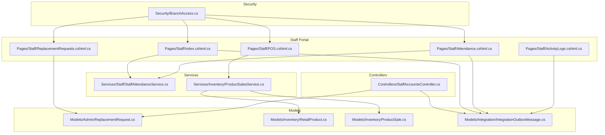
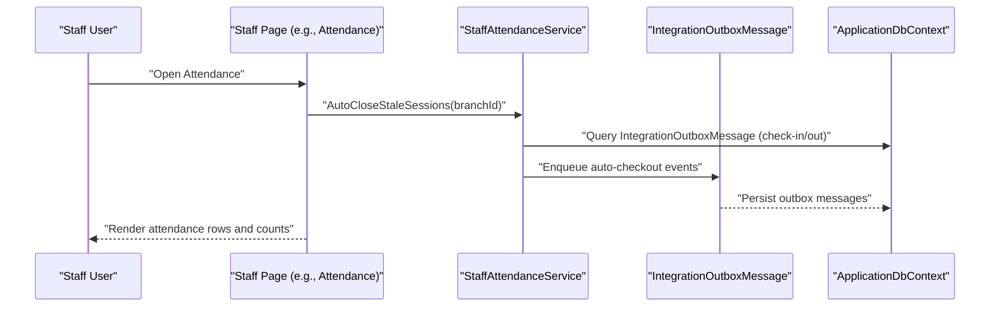
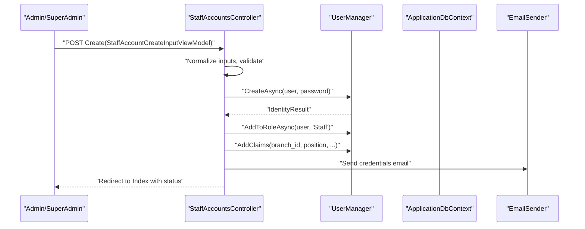
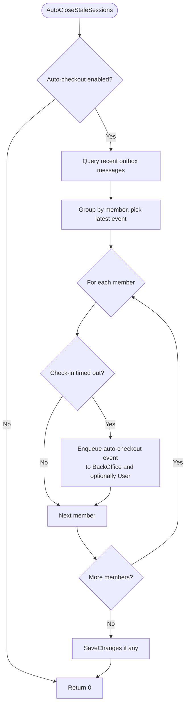
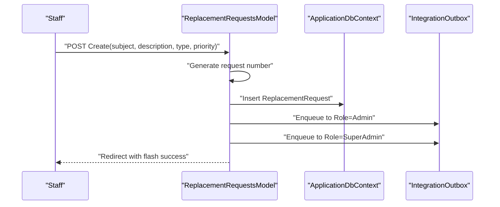
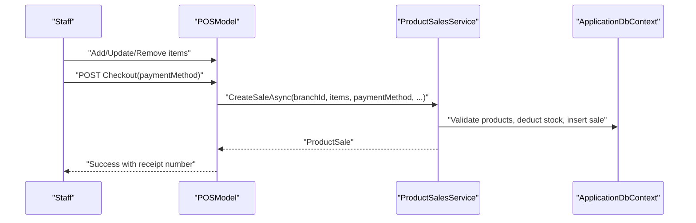
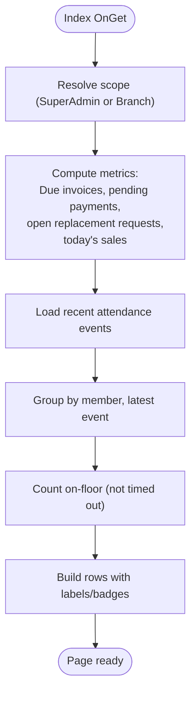
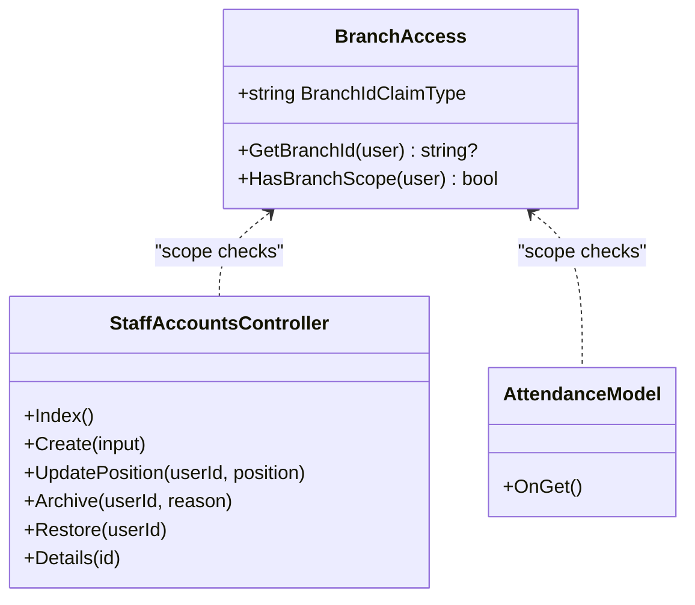
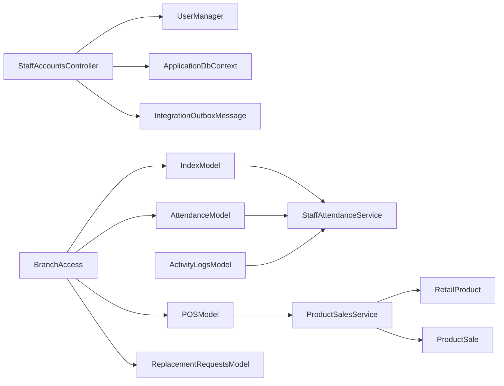

# Staff Management System

<cite>
**Referenced Files in This Document**
- [StaffAccountsController.cs](file://Controllers/StaffAccountsController.cs)
- [StaffAttendanceService.cs](file://Services/Staff/StaffAttendanceService.cs)
- [IStaffAttendanceService.cs](file://Services/Staff/IStaffAttendanceService.cs)
- [ReplacementRequest.cs](file://Models/Admin/ReplacementRequest.cs)
- [RetailProduct.cs](file://Models/Inventory/RetailProduct.cs)
- [Index.cshtml.cs](file://Pages/Staff/Index.cshtml.cs)
- [Attendance.cshtml.cs](file://Pages/Staff/Attendance.cshtml.cs)
- [ReplacementRequests.cshtml.cs](file://Pages/Staff/ReplacementRequests.cshtml.cs)
- [POS.cshtml.cs](file://Pages/Staff/POS.cshtml.cs)
- [ActivityLogs.cshtml.cs](file://Pages/Staff/ActivityLogs.cshtml.cs)
- [BranchAccess.cs](file://Security/BranchAccess.cs)
- [IntegrationOutboxMessage.cs](file://Models/Integration/IntegrationOutboxMessage.cs)
- [ProductSalesService.cs](file://Services/Inventory/ProductSalesService.cs)
- [ProductSale.cs](file://Models/Inventory/ProductSale.cs)
- [StaffLogin.cshtml.cs](file://Areas/Identity/Pages/Account/StaffLogin.cshtml.cs)
</cite>

## Table of Contents
1. [Introduction](#introduction)
2. [Project Structure](#project-structure)
3. [Core Components](#core-components)
4. [Architecture Overview](#architecture-overview)
5. [Detailed Component Analysis](#detailed-component-analysis)
6. [Dependency Analysis](#dependency-analysis)
7. [Performance Considerations](#performance-considerations)
8. [Troubleshooting Guide](#troubleshooting-guide)
9. [Conclusion](#conclusion)

## Introduction
This document describes the staff management capabilities within the EJC Fitness Gym system. It covers staff account lifecycle management, branch and role scoping, attendance tracking with automatic time-out enforcement, equipment/replacement requests, point-of-sale (POS) operations for retail sales, and dashboards that summarize operational metrics for staff. It also explains how staff access integrates with membership-related workflows and how branch-specific permissions are enforced.

## Project Structure
The staff management features span controllers, pages, services, models, and security utilities:
- Controllers: manage staff account creation, updates, archival, and role assignments.
- Pages: provide staff dashboards, attendance views, replacement requests, POS, and activity logs.
- Services: handle attendance automation and POS transaction processing.
- Models: define data structures for replacement requests, retail products, and POS sales.
- Security: enforce branch-scoped access via claims and middleware.
- Integration: use an outbox pattern to publish and deliver events across teams.

**Diagram sources**
- [Index.cshtml.cs:1-172](file://Pages/Staff/Index.cshtml.cs#L1-172)
- [Attendance.cshtml.cs:1-208](file://Pages/Staff/Attendance.cshtml.cs#L1-208)
- [ReplacementRequests.cshtml.cs:1-364](file://Pages/Staff/ReplacementRequests.cshtml.cs#L1-364)
- [POS.cshtml.cs:1-210](file://Pages/Staff/POS.cshtml.cs#L1-210)
- [ActivityLogs.cshtml.cs:1-192](file://Pages/Staff/ActivityLogs.cshtml.cs#L1-192)
- [StaffAccountsController.cs:1-1025](file://Controllers/StaffAccountsController.cs#L1-1025)
- [StaffAttendanceService.cs:1-160](file://Services/Staff/StaffAttendanceService.cs#L1-160)
- [ProductSalesService.cs:1-363](file://Services/Inventory/ProductSalesService.cs#L1-363)
- [BranchAccess.cs:1-31](file://Security/BranchAccess.cs#L1-31)
- [ReplacementRequest.cs:1-75](file://Models/Admin/ReplacementRequest.cs#L1-75)
- [RetailProduct.cs:1-42](file://Models/Inventory/RetailProduct.cs#L1-42)
- [ProductSale.cs:1-81](file://Models/Inventory/ProductSale.cs#L1-81)
- [IntegrationOutboxMessage.cs:1-57](file://Models/Integration/IntegrationOutboxMessage.cs#L1-57)

**Section sources**
- [Index.cshtml.cs:1-172](file://Pages/Staff/Index.cshtml.cs#L1-172)
- [StaffAccountsController.cs:1-1025](file://Controllers/StaffAccountsController.cs#L1-1025)
- [StaffAttendanceService.cs:1-160](file://Services/Staff/StaffAttendanceService.cs#L1-160)
- [ReplacementRequest.cs:1-75](file://Models/Admin/ReplacementRequest.cs#L1-75)
- [RetailProduct.cs:1-42](file://Models/Inventory/RetailProduct.cs#L1-42)
- [ProductSalesService.cs:1-363](file://Services/Inventory/ProductSalesService.cs#L1-363)
- [BranchAccess.cs:1-31](file://Security/BranchAccess.cs#L1-31)
- [IntegrationOutboxMessage.cs:1-57](file://Models/Integration/IntegrationOutboxMessage.cs#L1-57)

## Core Components
- Staff account management: creation, role assignment, branch assignment, position updates, archive/restore.
- Attendance tracking: check-in/check-out, auto-close stale sessions, on-floor counts, membership status badges.
- Replacement requests: submission, categorization, priority, status tracking, notifications.
- POS system: retail sales, cart management, payment methods, VAT calculation, inventory adjustments.
- Dashboards: staff index summary, recent attendance, open replacement requests, sales metrics.
- Branch access control: branch-scoped visibility and actions via claims and role checks.

**Section sources**
- [StaffAccountsController.cs:17-198](file://Controllers/StaffAccountsController.cs#L17-198)
- [Index.cshtml.cs:24-148](file://Pages/Staff/Index.cshtml.cs#L24-148)
- [Attendance.cshtml.cs:21-121](file://Pages/Staff/Attendance.cshtml.cs#L21-121)
- [ReplacementRequests.cshtml.cs:16-139](file://Pages/Staff/ReplacementRequests.cshtml.cs#L16-139)
- [POS.cshtml.cs:13-186](file://Pages/Staff/POS.cshtml.cs#L13-186)
- [ActivityLogs.cshtml.cs:24-72](file://Pages/Staff/ActivityLogs.cshtml.cs#L24-72)
- [BranchAccess.cs:5-29](file://Security/BranchAccess.cs#L5-29)

## Architecture Overview
The system uses a layered architecture:
- Presentation: Razor Pages for staff dashboards and forms.
- Application: Controllers and page models orchestrate workflows.
- Domain services: attendance automation and POS processing.
- Persistence: Entity Framework models and outbox for cross-team delivery.
- Security: Claims-based branch scoping and role-based authorization.

**Diagram sources**
- [Attendance.cshtml.cs:28-32](file://Pages/Staff/Attendance.cshtml.cs#L28-32)
- [StaffAttendanceService.cs:39-147](file://Services/Staff/StaffAttendanceService.cs#L39-147)
- [IntegrationOutboxMessage.cs:5-40](file://Models/Integration/IntegrationOutboxMessage.cs#L5-40)

**Section sources**
- [Attendance.cshtml.cs:28-32](file://Pages/Staff/Attendance.cshtml.cs#L28-32)
- [StaffAttendanceService.cs:39-147](file://Services/Staff/StaffAttendanceService.cs#L39-147)
- [IntegrationOutboxMessage.cs:5-40](file://Models/Integration/IntegrationOutboxMessage.cs#L5-40)

## Detailed Component Analysis

### Staff Account Management
- Registration: Admin/SuperAdmin create staff accounts, assign roles, branch, and position. Validation ensures email domain, phone format, supported positions, and active branch selection.
- Position assignment: Update position with normalization and validation; scoped to current branch for non-SuperAdmin actors.
- Archive/restore: Lockout-based archival with claims recording reason, timestamp, and actor; restore reverses lockout and updates history.
- Details view: Displays branch, position, archive status, and recent attendance handled by the staff member.

**Diagram sources**
- [StaffAccountsController.cs:71-198](file://Controllers/StaffAccountsController.cs#L71-198)

**Section sources**
- [StaffAccountsController.cs:71-198](file://Controllers/StaffAccountsController.cs#L71-198)
- [StaffAccountsController.cs:200-283](file://Controllers/StaffAccountsController.cs#L200-283)
- [StaffAccountsController.cs:285-489](file://Controllers/StaffAccountsController.cs#L285-489)
- [StaffAccountsController.cs:491-600](file://Controllers/StaffAccountsController.cs#L491-600)

### Attendance Tracking and Reporting
- Auto-close stale sessions: Background-friendly sweep of recent outbox messages; enqueues auto-checkout when a check-in exceeds configured timeout.
- Attendance page: Aggregates latest check-in/out per member, computes durations, flags on-floor/auto-closed/completed, and annotates membership status.
- Activity logs: Consolidates attendance, payment, and billing events filtered by branch scope.

**Diagram sources**
- [StaffAttendanceService.cs:39-147](file://Services/Staff/StaffAttendanceService.cs#L39-147)

**Section sources**
- [StaffAttendanceService.cs:25-37](file://Services/Staff/StaffAttendanceService.cs#L25-37)
- [StaffAttendanceService.cs:39-147](file://Services/Staff/StaffAttendanceService.cs#L39-147)
- [Attendance.cshtml.cs:28-121](file://Pages/Staff/Attendance.cshtml.cs#L28-121)
- [ActivityLogs.cshtml.cs:24-72](file://Pages/Staff/ActivityLogs.cshtml.cs#L24-72)
- [Index.cshtml.cs:102-148](file://Pages/Staff/Index.cshtml.cs#L102-148)

### Equipment/Replacement Requests
- Submission: Staff/Admin/SuperAdmin can create requests with subject, description, type, and priority; generates a unique request number.
- Distribution: Enqueues outbox messages to Admin and SuperAdmin roles upon creation.
- Listing: Filters by branch scope or requester; displays counts for open, escalated, and closed requests.
- Options: Loads equipment and retail product names scoped to branch for convenience.

**Diagram sources**
- [ReplacementRequests.cshtml.cs:68-139](file://Pages/Staff/ReplacementRequests.cshtml.cs#L68-139)
- [ReplacementRequest.cs:5-46](file://Models/Admin/ReplacementRequest.cs#L5-46)

**Section sources**
- [ReplacementRequests.cshtml.cs:16-139](file://Pages/Staff/ReplacementRequests.cshtml.cs#L16-139)
- [ReplacementRequest.cs:48-75](file://Models/Admin/ReplacementRequest.cs#L48-75)

### Point-of-Sale (POS) System
- Product catalog: Loads branch-scoped active retail products with positive stock.
- Cart management: Session-backed cart with add/update/remove/clear operations.
- Checkout: Validates items, checks stock, computes totals (subtotal/VAT), creates sale, posts to outbox and ledger, and clears cart.
- Payment methods: Supports cash, card, GCash, Maya, bank transfer, and charge-to-account.

**Diagram sources**
- [POS.cshtml.cs:65-186](file://Pages/Staff/POS.cshtml.cs#L65-186)
- [ProductSalesService.cs:106-218](file://Services/Inventory/ProductSalesService.cs#L106-218)
- [ProductSale.cs:5-39](file://Models/Inventory/ProductSale.cs#L5-39)

**Section sources**
- [POS.cshtml.cs:52-186](file://Pages/Staff/POS.cshtml.cs#L52-186)
- [ProductSalesService.cs:29-42](file://Services/Inventory/ProductSalesService.cs#L29-42)
- [ProductSalesService.cs:106-218](file://Services/Inventory/ProductSalesService.cs#L106-218)
- [ProductSale.cs:63-80](file://Models/Inventory/ProductSale.cs#L63-80)

### Staff Dashboard Components
- Summary cards: On-floor count, due-billing alerts, pending online payments, open replacement requests, today’s retail sales volume and amount.
- Recent attendance: Latest check-in/out events with labels and badges.
- Branch scoping: SuperAdmin sees all; others see only their branch.

**Diagram sources**
- [Index.cshtml.cs:33-148](file://Pages/Staff/Index.cshtml.cs#L33-148)

**Section sources**
- [Index.cshtml.cs:24-148](file://Pages/Staff/Index.cshtml.cs#L24-148)

### Branch Access Controls and Role-Based Permissions
- Branch scoping: Claims principal extension resolves branch_id; SuperAdmin bypasses scope.
- Controllers and pages restrict actions to authorized roles and enforce branch boundaries.
- Login flow: Staff login redirects to back-office login page.

**Diagram sources**
- [BranchAccess.cs:5-29](file://Security/BranchAccess.cs#L5-29)
- [StaffAccountsController.cs:57-69](file://Controllers/StaffAccountsController.cs#L57-69)
- [Attendance.cshtml.cs:28-31](file://Pages/Staff/Attendance.cshtml.cs#L28-31)

**Section sources**
- [BranchAccess.cs:5-29](file://Security/BranchAccess.cs#L5-29)
- [StaffAccountsController.cs:57-69](file://Controllers/StaffAccountsController.cs#L57-69)
- [Attendance.cshtml.cs:28-31](file://Pages/Staff/Attendance.cshtml.cs#L28-31)
- [StaffLogin.cshtml.cs:34-36](file://Areas/Identity/Pages/Account/StaffLogin.cshtml.cs#L34-36)

## Dependency Analysis
- Controllers depend on Identity services for user management and claims.
- Pages depend on services for attendance and sales, and on the database for queries.
- Services depend on the outbox for asynchronous inter-team communication.
- Models encapsulate persistence and enumerations for statuses and types.

**Diagram sources**
- [StaffAccountsController.cs:32-55](file://Controllers/StaffAccountsController.cs#L32-55)
- [Index.cshtml.cs:15-22](file://Pages/Staff/Index.cshtml.cs#L15-22)
- [Attendance.cshtml.cs:12-19](file://Pages/Staff/Attendance.cshtml.cs#L12-19)
- [ActivityLogs.cshtml.cs:13-20](file://Pages/Staff/ActivityLogs.cshtml.cs#L13-20)
- [POS.cshtml.cs:16-24](file://Pages/Staff/POS.cshtml.cs#L16-24)
- [ProductSalesService.cs:11-27](file://Services/Inventory/ProductSalesService.cs#L11-27)
- [BranchAccess.cs:9-28](file://Security/BranchAccess.cs#L9-28)

**Section sources**
- [StaffAccountsController.cs:32-55](file://Controllers/StaffAccountsController.cs#L32-55)
- [Index.cshtml.cs:15-22](file://Pages/Staff/Index.cshtml.cs#L15-22)
- [Attendance.cshtml.cs:12-19](file://Pages/Staff/Attendance.cshtml.cs#L12-19)
- [ActivityLogs.cshtml.cs:13-20](file://Pages/Staff/ActivityLogs.cshtml.cs#L13-20)
- [POS.cshtml.cs:16-24](file://Pages/Staff/POS.cshtml.cs#L16-24)
- [ProductSalesService.cs:11-27](file://Services/Inventory/ProductSalesService.cs#L11-27)
- [BranchAccess.cs:9-28](file://Security/BranchAccess.cs#L9-28)

## Performance Considerations
- Attendance auto-close uses bounded look-back windows and capped event counts to avoid heavy scans.
- Queries leverage AsNoTracking for read-heavy pages and apply branch filters to reduce result sets.
- Outbox messages are batched and saved once per sweep to minimize database writes.
- POS checkout validates stock and computes totals in-memory before persistence.

[No sources needed since this section provides general guidance]

## Troubleshooting Guide
- Staff account creation fails: Verify email domain configuration, supported positions, active branch selection, and that the email is unique.
- Position update denied: Ensure the actor has the correct branch scope and the target user belongs to the same branch (non-SuperAdmin).
- Archive/restore issues: Confirm lockout enablement and claim updates succeeded; check actor is not archiving themselves.
- Attendance not auto-closing: Check auto-checkout configuration and look-back window; ensure outbox messages exist for the relevant branch.
- Replacement request not visible: Confirm branch scope and whether the requester or Admin/SuperAdmin role can view the request.
- POS checkout errors: Inspect stock availability, item quantities, and payment method mapping; review exception messages returned to the UI.

**Section sources**
- [StaffAccountsController.cs:71-198](file://Controllers/StaffAccountsController.cs#L71-198)
- [StaffAccountsController.cs:200-283](file://Controllers/StaffAccountsController.cs#L200-283)
- [StaffAccountsController.cs:285-489](file://Controllers/StaffAccountsController.cs#L285-489)
- [StaffAttendanceService.cs:39-147](file://Services/Staff/StaffAttendanceService.cs#L39-147)
- [ReplacementRequests.cshtml.cs:56-66](file://Pages/Staff/ReplacementRequests.cshtml.cs#L56-66)
- [POS.cshtml.cs:132-186](file://Pages/Staff/POS.cshtml.cs#L132-186)

## Conclusion
The EJC Fitness Gym staff management system integrates identity-driven account management, branch-scoped access, automated attendance tracking, replacement request workflows, and a retail POS with inventory management. Dashboards consolidate real-time metrics for efficient operations, while the outbox pattern enables reliable cross-team communication. Adhering to branch and role constraints ensures secure, localized control for staff and administrative functions.