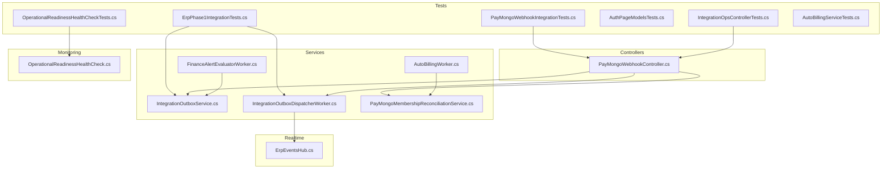
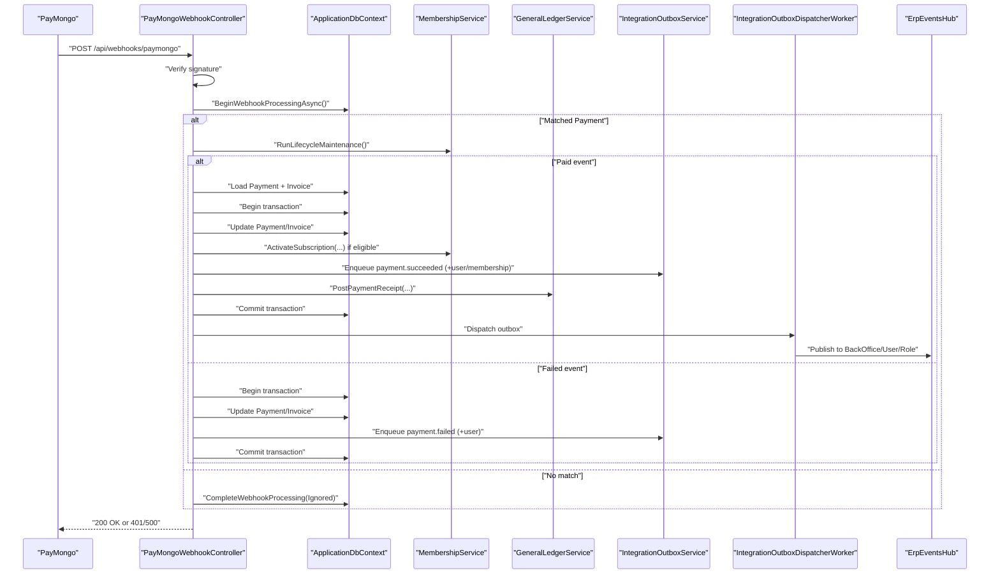
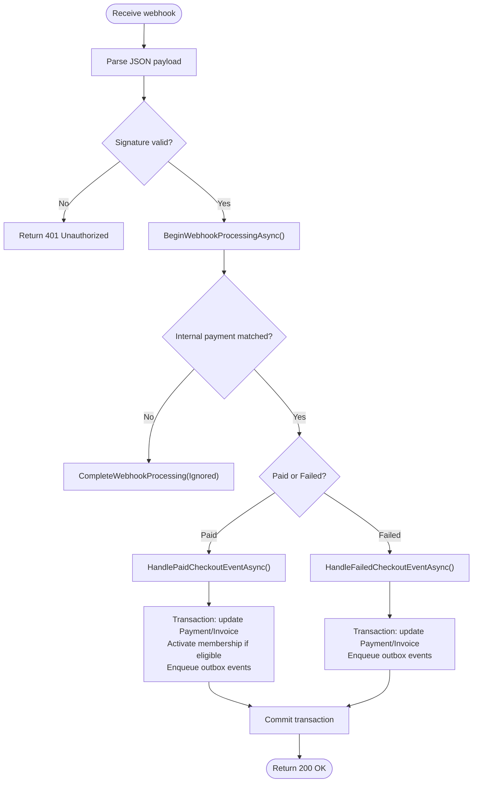
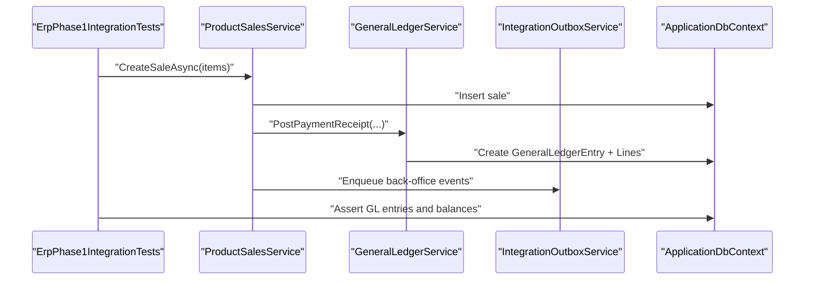
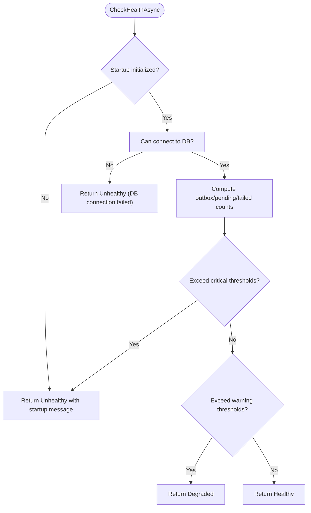
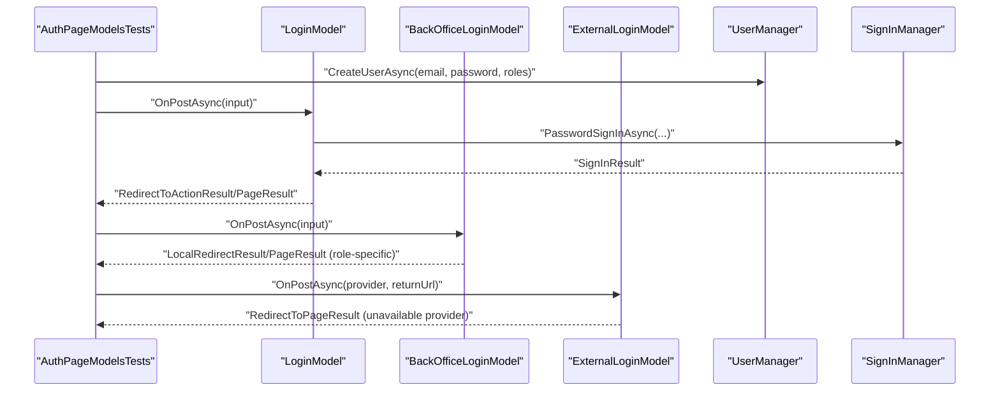
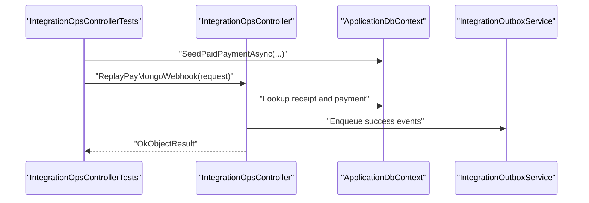
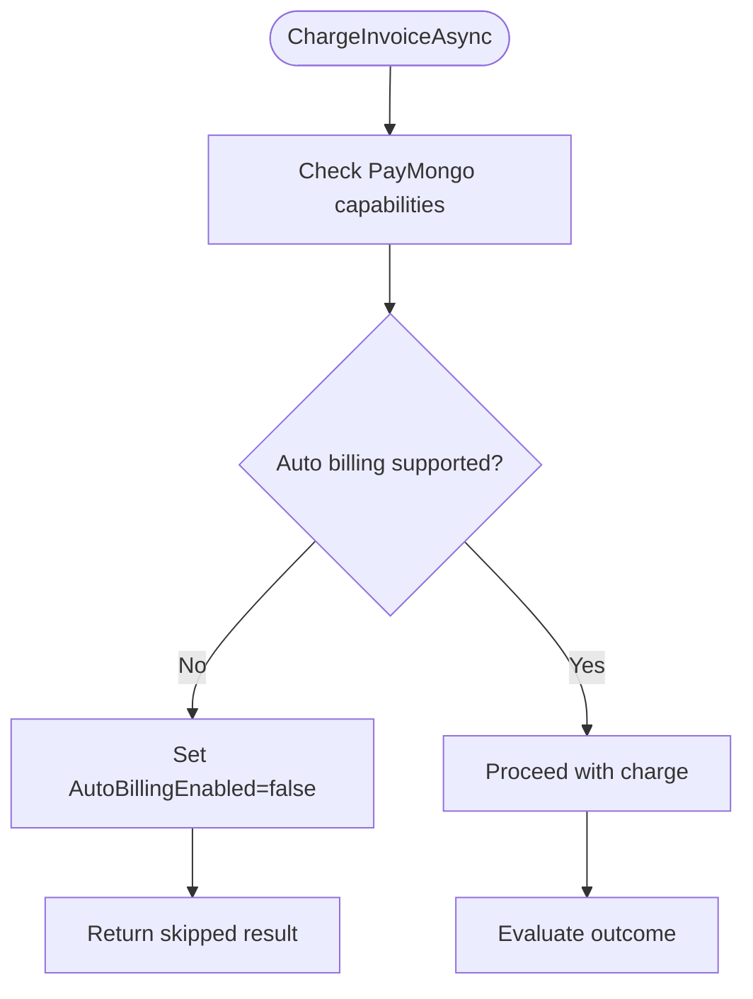
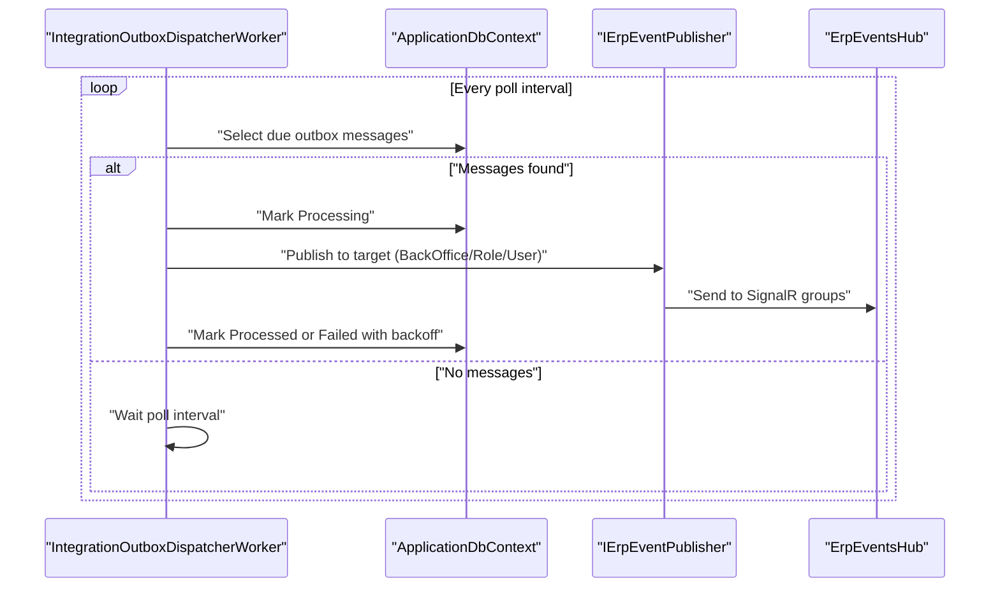
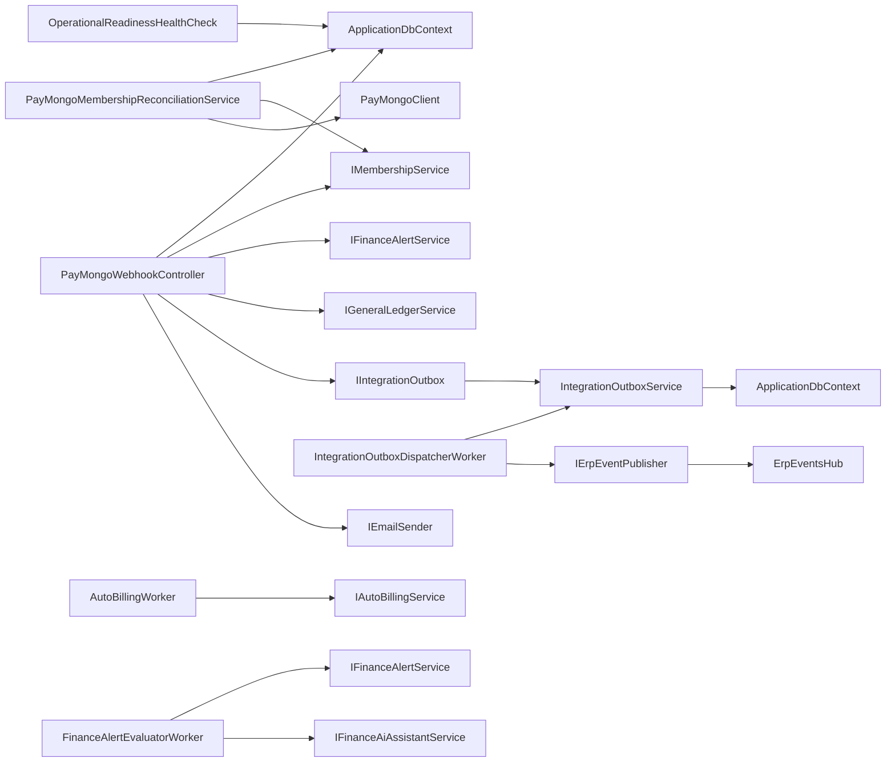

# Integration Testing

<cite>
**Referenced Files in This Document**
- [PayMongoWebhookIntegrationTests.cs](file://EJCFitnessGym.Tests/PayMongoWebhookIntegrationTests.cs)
- [ErpPhase1IntegrationTests.cs](file://EJCFitnessGym.Tests/ErpPhase1IntegrationTests.cs)
- [OperationalReadinessHealthCheckTests.cs](file://EJCFitnessGym.Tests/OperationalReadinessHealthCheckTests.cs)
- [AuthPageModelsTests.cs](file://EJCFitnessGym.Tests/AuthPageModelsTests.cs)
- [DashboardControllerTests.cs](file://EJCFitnessGym.Tests/DashboardControllerTests.cs)
- [IntegrationOpsControllerTests.cs](file://EJCFitnessGym.Tests/IntegrationOpsControllerTests.cs)
- [AutoBillingServiceTests.cs](file://EJCFitnessGym.Tests/AutoBillingServiceTests.cs)
- [PayMongoWebhookController.cs](file://Controllers/PayMongoWebhookController.cs)
- [IntegrationOutboxService.cs](file://Services/Integration/IntegrationOutboxService.cs)
- [IntegrationOutboxDispatcherWorker.cs](file://Services/Integration/IntegrationOutboxDispatcherWorker.cs)
- [PayMongoMembershipReconciliationService.cs](file://Services/Payments/PayMongoMembershipReconciliationService.cs)
- [OperationalReadinessHealthCheck.cs](file://Services/Monitoring/OperationalReadinessHealthCheck.cs)
- [ErpEventsHub.cs](file://Hubs/ErpEventsHub.cs)
- [AutoBillingWorker.cs](file://Services/Payments/AutoBillingWorker.cs)
- [FinanceAlertEvaluatorWorker.cs](file://Services/Finance/FinanceAlertEvaluatorWorker.cs)
</cite>

## Table of Contents
1. [Introduction](#introduction)
2. [Project Structure](#project-structure)
3. [Core Components](#core-components)
4. [Architecture Overview](#architecture-overview)
5. [Detailed Component Analysis](#detailed-component-analysis)
6. [Dependency Analysis](#dependency-analysis)
7. [Performance Considerations](#performance-considerations)
8. [Troubleshooting Guide](#troubleshooting-guide)
9. [Conclusion](#conclusion)
10. [Appendices](#appendices)

## Introduction
This document provides comprehensive integration testing guidance for the EJC Fitness Gym system. It focuses on validating controller endpoints, service-to-service interactions, external system integrations (notably PayMongo), operational readiness health checks, authentication page model behavior, database transactions, background services, and real-time communication. It also covers environment setup, test database management, cleanup, and testing patterns for multi-component workflows and end-to-end business scenarios.

## Project Structure
The integration tests reside under the test project and exercise controllers, services, hubs, workers, and health checks. The primary integration touchpoints are:
- PayMongo webhook endpoint and reconciliation services
- ERP integration via outbox and dispatcher worker
- Operational readiness health checks
- Authentication page models and controller routing
- Real-time events hub and outbox publishing
- Background workers for auto billing and finance alerts

**Diagram sources**
- [PayMongoWebhookIntegrationTests.cs:1-585](file://EJCFitnessGym.Tests/PayMongoWebhookIntegrationTests.cs#L1-L585)
- [ErpPhase1IntegrationTests.cs:1-334](file://EJCFitnessGym.Tests/ErpPhase1IntegrationTests.cs#L1-L334)
- [OperationalReadinessHealthCheckTests.cs:1-128](file://EJCFitnessGym.Tests/OperationalReadinessHealthCheckTests.cs#L1-L128)
- [AuthPageModelsTests.cs:1-325](file://EJCFitnessGym.Tests/AuthPageModelsTests.cs#L1-L325)
- [IntegrationOpsControllerTests.cs:1-228](file://EJCFitnessGym.Tests/IntegrationOpsControllerTests.cs#L1-L228)
- [AutoBillingServiceTests.cs:1-97](file://EJCFitnessGym.Tests/AutoBillingServiceTests.cs#L1-L97)
- [PayMongoWebhookController.cs:1-995](file://Controllers/PayMongoWebhookController.cs#L1-L995)
- [IntegrationOutboxService.cs:1-94](file://Services/Integration/IntegrationOutboxService.cs#L1-L94)
- [IntegrationOutboxDispatcherWorker.cs:1-194](file://Services/Integration/IntegrationOutboxDispatcherWorker.cs#L1-L194)
- [PayMongoMembershipReconciliationService.cs:1-423](file://Services/Payments/PayMongoMembershipReconciliationService.cs#L1-L423)
- [OperationalReadinessHealthCheck.cs:1-130](file://Services/Monitoring/OperationalReadinessHealthCheck.cs#L1-L130)
- [ErpEventsHub.cs:1-50](file://Hubs/ErpEventsHub.cs#L1-L50)
- [AutoBillingWorker.cs:1-122](file://Services/Payments/AutoBillingWorker.cs#L1-L122)
- [FinanceAlertEvaluatorWorker.cs:1-112](file://Services/Finance/FinanceAlertEvaluatorWorker.cs#L1-L112)

**Section sources**
- [PayMongoWebhookIntegrationTests.cs:1-585](file://EJCFitnessGym.Tests/PayMongoWebhookIntegrationTests.cs#L1-L585)
- [ErpPhase1IntegrationTests.cs:1-334](file://EJCFitnessGym.Tests/ErpPhase1IntegrationTests.cs#L1-L334)
- [OperationalReadinessHealthCheckTests.cs:1-128](file://EJCFitnessGym.Tests/OperationalReadinessHealthCheckTests.cs#L1-L128)
- [AuthPageModelsTests.cs:1-325](file://EJCFitnessGym.Tests/AuthPageModelsTests.cs#L1-L325)
- [IntegrationOpsControllerTests.cs:1-228](file://EJCFitnessGym.Tests/IntegrationOpsControllerTests.cs#L1-L228)
- [AutoBillingServiceTests.cs:1-97](file://EJCFitnessGym.Tests/AutoBillingServiceTests.cs#L1-L97)

## Core Components
- PayMongo webhook controller validates signatures, deduplicates receipts, reconciles payments, activates memberships, enqueues outbox messages, posts to the general ledger, and sends emails.
- Integration outbox persists asynchronous events and the dispatcher worker publishes them to SignalR groups.
- ERP phase 1 tests validate retail sales, reversals, supply requests, and finance alert outbox messaging.
- Operational readiness health check evaluates outbox backlog, failed outbox messages, and webhook failures.
- Authentication page models validate role-based redirects and error handling.
- Background workers orchestrate auto billing and finance alert evaluations.

**Section sources**
- [PayMongoWebhookController.cs:1-995](file://Controllers/PayMongoWebhookController.cs#L1-L995)
- [IntegrationOutboxService.cs:1-94](file://Services/Integration/IntegrationOutboxService.cs#L1-L94)
- [IntegrationOutboxDispatcherWorker.cs:1-194](file://Services/Integration/IntegrationOutboxDispatcherWorker.cs#L1-L194)
- [ErpPhase1IntegrationTests.cs:1-334](file://EJCFitnessGym.Tests/ErpPhase1IntegrationTests.cs#L1-L334)
- [OperationalReadinessHealthCheck.cs:1-130](file://Services/Monitoring/OperationalReadinessHealthCheck.cs#L1-L130)
- [AuthPageModelsTests.cs:1-325](file://EJCFitnessGym.Tests/AuthPageModelsTests.cs#L1-L325)
- [AutoBillingWorker.cs:1-122](file://Services/Payments/AutoBillingWorker.cs#L1-L122)
- [FinanceAlertEvaluatorWorker.cs:1-112](file://Services/Finance/FinanceAlertEvaluatorWorker.cs#L1-L112)

## Architecture Overview
The integration architecture centers around:
- Webhook ingestion and idempotent processing
- Transaction-scoped updates to invoices, payments, subscriptions
- Outbox pattern for decoupled event delivery
- Real-time SignalR publishing for back-office and user notifications
- Health monitoring and alerting

**Diagram sources**
- [PayMongoWebhookController.cs:73-187](file://Controllers/PayMongoWebhookController.cs#L73-L187)
- [PayMongoWebhookController.cs:189-279](file://Controllers/PayMongoWebhookController.cs#L189-L279)
- [PayMongoWebhookController.cs:320-539](file://Controllers/PayMongoWebhookController.cs#L320-L539)
- [PayMongoWebhookController.cs:541-622](file://Controllers/PayMongoWebhookController.cs#L541-L622)
- [IntegrationOutboxService.cs:18-58](file://Services/Integration/IntegrationOutboxService.cs#L18-L58)
- [IntegrationOutboxDispatcherWorker.cs:58-133](file://Services/Integration/IntegrationOutboxDispatcherWorker.cs#L58-L133)
- [ErpEventsHub.cs:12-47](file://Hubs/ErpEventsHub.cs#L12-L47)

## Detailed Component Analysis

### PayMongo Webhook Integration Tests
These tests validate:
- Duplicate webhook idempotency and receipt tracking
- Failure handling and retry behavior
- Underpayment scenarios and reconciliation warnings
- Replay protection for older failed events
- Production signature enforcement and validation
- End-to-end payment success and membership activation

Testing patterns:
- In-memory SQLite databases per test method
- Seeding invoices, payments, and subscription plans
- Building JSON payloads and optional PayMongo signature headers
- Using a flaky outbox to simulate transient failures
- Assertions on outbox counts, receipts, payment/invoice states, and queued events

**Diagram sources**
- [PayMongoWebhookIntegrationTests.cs:25-104](file://EJCFitnessGym.Tests/PayMongoWebhookIntegrationTests.cs#L25-L104)
- [PayMongoWebhookIntegrationTests.cs:106-139](file://EJCFitnessGym.Tests/PayMongoWebhookIntegrationTests.cs#L106-L139)
- [PayMongoWebhookIntegrationTests.cs:141-205](file://EJCFitnessGym.Tests/PayMongoWebhookIntegrationTests.cs#L141-L205)
- [PayMongoWebhookIntegrationTests.cs:207-262](file://EJCFitnessGym.Tests/PayMongoWebhookIntegrationTests.cs#L207-L262)
- [PayMongoWebhookController.cs:73-187](file://Controllers/PayMongoWebhookController.cs#L73-L187)
- [PayMongoWebhookController.cs:320-539](file://Controllers/PayMongoWebhookController.cs#L320-L539)
- [PayMongoWebhookController.cs:541-622](file://Controllers/PayMongoWebhookController.cs#L541-L622)

**Section sources**
- [PayMongoWebhookIntegrationTests.cs:25-262](file://EJCFitnessGym.Tests/PayMongoWebhookIntegrationTests.cs#L25-L262)
- [PayMongoWebhookController.cs:624-682](file://Controllers/PayMongoWebhookController.cs#L624-L682)

### ERP Phase 1 Integration Tests
Validates:
- Retail sale posting to general ledger with balanced entries
- Sale voiding and reversal entries
- Supply request lifecycle and stock updates
- Finance alert evaluation queuing outbox messages

Testing patterns:
- In-memory SQLite per scenario
- Service composition: ProductSalesService, GeneralLedgerService, IntegrationOutboxService
- Assertions on GL entries, account codes, and inventory quantities

**Diagram sources**
- [ErpPhase1IntegrationTests.cs:19-67](file://EJCFitnessGym.Tests/ErpPhase1IntegrationTests.cs#L19-L67)
- [ErpPhase1IntegrationTests.cs:69-123](file://EJCFitnessGym.Tests/ErpPhase1IntegrationTests.cs#L69-L123)
- [ErpPhase1IntegrationTests.cs:125-172](file://EJCFitnessGym.Tests/ErpPhase1IntegrationTests.cs#L125-L172)
- [ErpPhase1IntegrationTests.cs:174-212](file://EJCFitnessGym.Tests/ErpPhase1IntegrationTests.cs#L174-L212)

**Section sources**
- [ErpPhase1IntegrationTests.cs:19-212](file://EJCFitnessGym.Tests/ErpPhase1IntegrationTests.cs#L19-L212)

### Operational Readiness Health Check Tests
Validates:
- Healthy state when thresholds are not exceeded
- Unhealthy state when critical thresholds are met
- Startup initialization failure propagation

Testing patterns:
- Seeding outbox and webhook receipt records
- Configuring OperationalHealthOptions
- Asserting HealthStatus and data keys

**Diagram sources**
- [OperationalReadinessHealthCheckTests.cs:13-93](file://EJCFitnessGym.Tests/OperationalReadinessHealthCheckTests.cs#L13-L93)
- [OperationalReadinessHealthCheck.cs:25-127](file://Services/Monitoring/OperationalReadinessHealthCheck.cs#L25-L127)

**Section sources**
- [OperationalReadinessHealthCheckTests.cs:13-93](file://EJCFitnessGym.Tests/OperationalReadinessHealthCheckTests.cs#L13-L93)
- [OperationalReadinessHealthCheck.cs:1-130](file://Services/Monitoring/OperationalReadinessHealthCheck.cs#L1-L130)

### Authentication Page Model Validation
Validates:
- Role-based redirections and landing pages
- Back-office login restrictions
- External login provider availability checks
- Model state errors and redirects

Testing patterns:
- In-memory Identity setup with roles
- Creating page models with mocked environments and URL helpers
- Simulating user sign-in and asserting redirects/pages

**Diagram sources**
- [AuthPageModelsTests.cs:22-121](file://EJCFitnessGym.Tests/AuthPageModelsTests.cs#L22-L121)
- [DashboardControllerTests.cs:11-31](file://EJCFitnessGym.Tests/DashboardControllerTests.cs#L11-L31)

**Section sources**
- [AuthPageModelsTests.cs:22-121](file://EJCFitnessGym.Tests/AuthPageModelsTests.cs#L22-L121)
- [DashboardControllerTests.cs:11-31](file://EJCFitnessGym.Tests/DashboardControllerTests.cs#L11-L31)

### Integration Operations Controller Tests
Validates:
- Manual retry of failed outbox messages
- Replay of PayMongo webhooks by reference or event key
- Idempotency and conflict handling during replays

Testing patterns:
- Seeding payments, invoices, and subscriptions
- Using authenticated controller context
- Asserting receipt states and queued outbox events

**Diagram sources**
- [IntegrationOpsControllerTests.cs:48-110](file://EJCFitnessGym.Tests/IntegrationOpsControllerTests.cs#L48-L110)
- [IntegrationOpsControllerTests.cs:117-135](file://EJCFitnessGym.Tests/IntegrationOpsControllerTests.cs#L117-L135)

**Section sources**
- [IntegrationOpsControllerTests.cs:16-110](file://EJCFitnessGym.Tests/IntegrationOpsControllerTests.cs#L16-L110)

### Auto Billing Service Tests
Validates:
- Unsupported auto billing capability disables future charges
- Skips charge and clears auto billing flag when unsupported

Testing patterns:
- In-memory SQLite
- PayMongo client configured with placeholder key
- Assertions on saved payment method state and payment count

**Diagram sources**
- [AutoBillingServiceTests.cs:13-62](file://EJCFitnessGym.Tests/AutoBillingServiceTests.cs#L13-L62)

**Section sources**
- [AutoBillingServiceTests.cs:13-62](file://EJCFitnessGym.Tests/AutoBillingServiceTests.cs#L13-L62)

### Real-Time Communication and Outbox Dispatcher
Validates:
- Outbox message dispatching and retries
- Real-time publishing to BackOffice, Role, and User groups
- Worker scheduling and exponential backoff

**Diagram sources**
- [IntegrationOutboxDispatcherWorker.cs:58-133](file://Services/Integration/IntegrationOutboxDispatcherWorker.cs#L58-L133)
- [ErpEventsHub.cs:12-47](file://Hubs/ErpEventsHub.cs#L12-L47)

**Section sources**
- [IntegrationOutboxDispatcherWorker.cs:26-133](file://Services/Integration/IntegrationOutboxDispatcherWorker.cs#L26-L133)
- [ErpEventsHub.cs:7-48](file://Hubs/ErpEventsHub.cs#L7-L48)

## Dependency Analysis
- PayMongoWebhookController depends on ApplicationDbContext, IMembershipService, IFinanceAlertService, IGeneralLedgerService, IIntegrationOutbox, IEmailSender, and PayMongo options/environment.
- IntegrationOutboxService persists outbox messages; IntegrationOutboxDispatcherWorker consumes them and publishes via SignalR.
- PayMongoMembershipReconciliationService reconciles pending payments against PayMongo checkout sessions and updates invoices/subscriptions.
- OperationalReadinessHealthCheck reads outbox and webhook receipt metrics to determine health.
- Background workers coordinate periodic tasks for auto billing and finance alerts.

**Diagram sources**
- [PayMongoWebhookController.cs:51-71](file://Controllers/PayMongoWebhookController.cs#L51-L71)
- [IntegrationOutboxService.cs:13-16](file://Services/Integration/IntegrationOutboxService.cs#L13-L16)
- [IntegrationOutboxDispatcherWorker.cs:16-24](file://Services/Integration/IntegrationOutboxDispatcherWorker.cs#L16-L24)
- [PayMongoMembershipReconciliationService.cs:20-32](file://Services/Payments/PayMongoMembershipReconciliationService.cs#L20-L32)
- [OperationalReadinessHealthCheck.cs:15-23](file://Services/Monitoring/OperationalReadinessHealthCheck.cs#L15-L23)
- [AutoBillingWorker.cs:34-48](file://Services/Payments/AutoBillingWorker.cs#L34-L48)
- [FinanceAlertEvaluatorWorker.cs:11-18](file://Services/Finance/FinanceAlertEvaluatorWorker.cs#L11-L18)

**Section sources**
- [PayMongoWebhookController.cs:1-995](file://Controllers/PayMongoWebhookController.cs#L1-L995)
- [IntegrationOutboxService.cs:1-94](file://Services/Integration/IntegrationOutboxService.cs#L1-L94)
- [IntegrationOutboxDispatcherWorker.cs:1-194](file://Services/Integration/IntegrationOutboxDispatcherWorker.cs#L1-L194)
- [PayMongoMembershipReconciliationService.cs:1-423](file://Services/Payments/PayMongoMembershipReconciliationService.cs#L1-L423)
- [OperationalReadinessHealthCheck.cs:1-130](file://Services/Monitoring/OperationalReadinessHealthCheck.cs#L1-L130)
- [AutoBillingWorker.cs:1-122](file://Services/Payments/AutoBillingWorker.cs#L1-L122)
- [FinanceAlertEvaluatorWorker.cs:1-112](file://Services/Finance/FinanceAlertEvaluatorWorker.cs#L1-L112)

## Performance Considerations
- Outbox batching and polling intervals should be tuned to workload; tests demonstrate batch sizes up to 500 and poll intervals within 1–300 seconds.
- Exponential backoff prevents thundering herds on transient failures.
- Transactions in webhook handlers minimize partial state and ensure consistency for payment/invoice updates.
- Health checks aggregate counts and ages to detect bottlenecks early.

[No sources needed since this section provides general guidance]

## Troubleshooting Guide
Common issues and validations:
- Webhook signature failures: Ensure production environment requires signature and that the signature header is present and within tolerance.
- Duplicate receipts: Controller ignores concurrent or already processed events; verify receipt statuses and attempt counts.
- Failed outbox messages: Use the integration ops controller to retry failed messages and reset next attempt timing.
- Health check regressions: Monitor pending/outbox age, failed outbox counts, and webhook failures; adjust thresholds accordingly.
- Authentication redirects: Validate role assignments and login flows; confirm page model redirects align with expected landing pages.

**Section sources**
- [PayMongoWebhookIntegrationTests.cs:207-231](file://EJCFitnessGym.Tests/PayMongoWebhookIntegrationTests.cs#L207-L231)
- [PayMongoWebhookIntegrationTests.cs:233-262](file://EJCFitnessGym.Tests/PayMongoWebhookIntegrationTests.cs#L233-L262)
- [PayMongoWebhookController.cs:624-682](file://Controllers/PayMongoWebhookController.cs#L624-L682)
- [IntegrationOpsControllerTests.cs:16-46](file://EJCFitnessGym.Tests/IntegrationOpsControllerTests.cs#L16-L46)
- [OperationalReadinessHealthCheckTests.cs:40-76](file://EJCFitnessGym.Tests/OperationalReadinessHealthCheckTests.cs#L40-L76)

## Conclusion
The integration tests comprehensively validate end-to-end flows across controllers, services, background workers, and real-time channels. They emphasize idempotency, transactional consistency, and observability via outbox and health checks. The patterns demonstrated here provide a robust foundation for extending coverage to additional external systems and complex business scenarios.

[No sources needed since this section summarizes without analyzing specific files]

## Appendices

### Integration Test Environment Setup
- Use in-memory databases per test method to isolate state and speed execution.
- For SQL Server or SQLite-backed tests, ensure migrations are applied before assertions.
- Configure host environment and PayMongo options to simulate development vs. production behavior.

**Section sources**
- [PayMongoWebhookIntegrationTests.cs:442-455](file://EJCFitnessGym.Tests/PayMongoWebhookIntegrationTests.cs#L442-L455)
- [ErpPhase1IntegrationTests.cs:214-227](file://EJCFitnessGym.Tests/ErpPhase1IntegrationTests.cs#L214-L227)
- [OperationalReadinessHealthCheckTests.cs:95-108](file://EJCFitnessGym.Tests/OperationalReadinessHealthCheckTests.cs#L95-L108)
- [IntegrationOpsControllerTests.cs:195-208](file://EJCFitnessGym.Tests/IntegrationOpsControllerTests.cs#L195-L208)

### Test Database Management and Cleanup
- Dispose of DbContext and underlying connections in IAsyncDisposable handles to prevent resource leaks.
- Clear change trackers between repeated invocations to avoid stale entity states.
- Seed minimal data sets per scenario to reduce test runtime and complexity.

**Section sources**
- [PayMongoWebhookIntegrationTests.cs:553-569](file://EJCFitnessGym.Tests/PayMongoWebhookIntegrationTests.cs#L553-L569)
- [ErpPhase1IntegrationTests.cs:229-245](file://EJCFitnessGym.Tests/ErpPhase1IntegrationTests.cs#L229-L245)
- [IntegrationOpsControllerTests.cs:210-226](file://EJCFitnessGym.Tests/IntegrationOpsControllerTests.cs#L210-L226)

### Testing Patterns for Multi-Component Workflows
- End-to-end webhook flow: Build payload, inject signature header, assert outbox messages and GL entries.
- ERP retail flow: Create sale, void sale, confirm supply receipt, and validate stock and cost price.
- Health monitoring: Seed thresholds, assert degraded/healthy transitions.
- Authentication: Role-based redirects and provider availability checks.

**Section sources**
- [PayMongoWebhookIntegrationTests.cs:25-104](file://EJCFitnessGym.Tests/PayMongoWebhookIntegrationTests.cs#L25-L104)
- [ErpPhase1IntegrationTests.cs:19-123](file://EJCFitnessGym.Tests/ErpPhase1IntegrationTests.cs#L19-L123)
- [OperationalReadinessHealthCheckTests.cs:13-76](file://EJCFitnessGym.Tests/OperationalReadinessHealthCheckTests.cs#L13-L76)
- [AuthPageModelsTests.cs:22-121](file://EJCFitnessGym.Tests/AuthPageModelsTests.cs#L22-L121)

### Validation Strategies for Complex Integration Points
- Transaction boundaries: Wrap payment/invoice updates and membership activation in transactions; commit only after outbox enqueue and GL posting.
- Idempotency: Use inbound webhook receipts keyed by event identifiers; reject duplicates or concurrent processing windows.
- Outbox reliability: Validate event counts, targets, and payloads; confirm exponential backoff and final failure states.
- Real-time delivery: Subscribe to SignalR groups and assert event payloads for user/back-office recipients.

**Section sources**
- [PayMongoWebhookController.cs:372-518](file://Controllers/PayMongoWebhookController.cs#L372-L518)
- [PayMongoWebhookController.cs:564-621](file://Controllers/PayMongoWebhookController.cs#L564-L621)
- [IntegrationOutboxDispatcherWorker.cs:58-133](file://Services/Integration/IntegrationOutboxDispatcherWorker.cs#L58-L133)
- [ErpEventsHub.cs:12-47](file://Hubs/ErpEventsHub.cs#L12-L47)