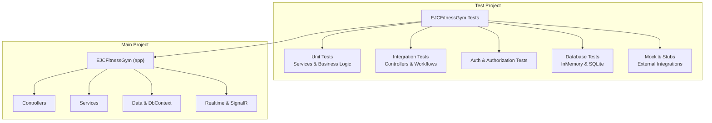
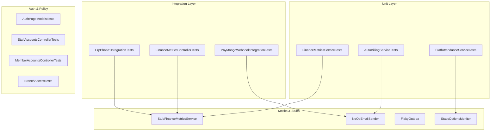
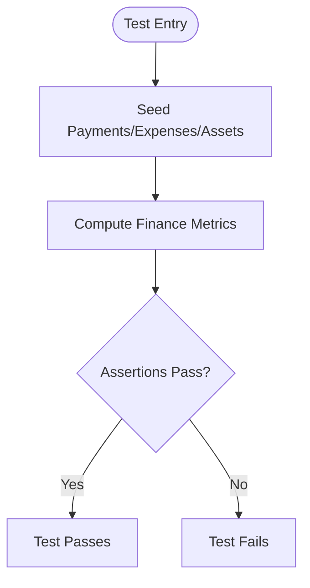
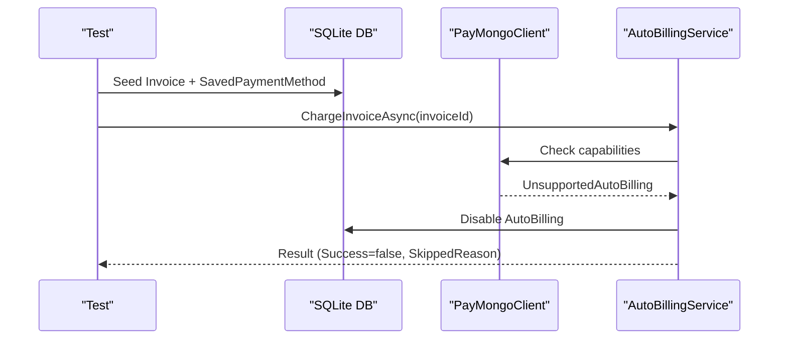
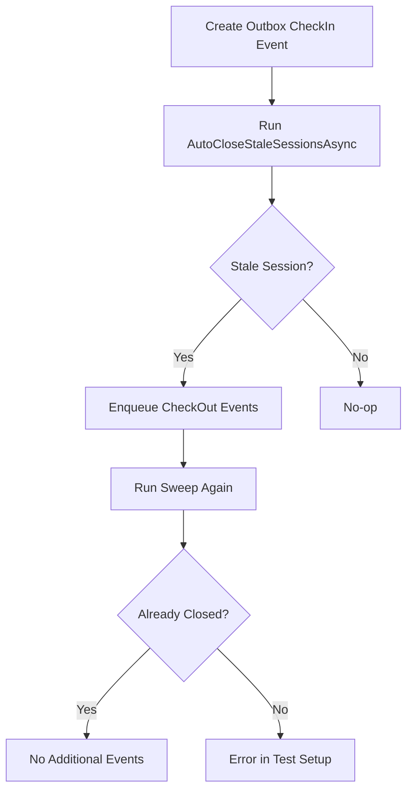
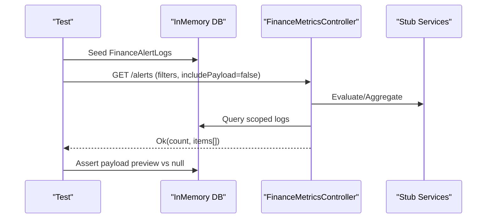
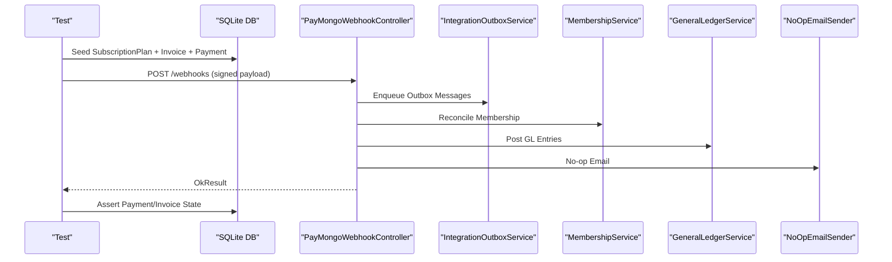
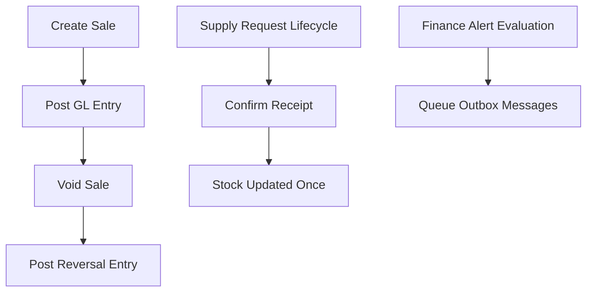
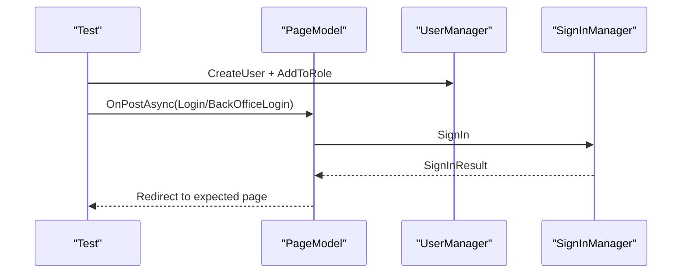
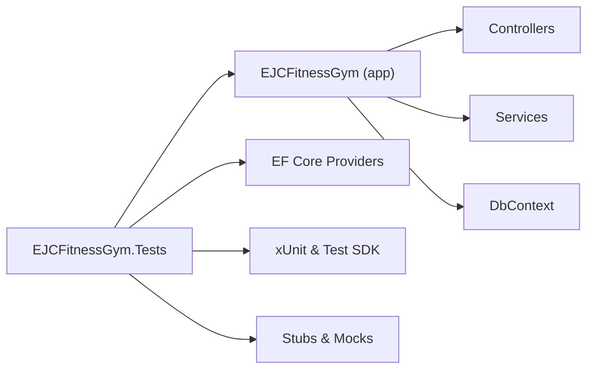

# Testing Strategy

<cite>
**Referenced Files in This Document**
- [EJCFitnessGym.Tests.csproj](file://EJCFitnessGym.Tests/EJCFitnessGym.Tests.csproj)
- [DashboardControllerTests.cs](file://EJCFitnessGym.Tests/DashboardControllerTests.cs)
- [FinanceMetricsControllerTests.cs](file://EJCFitnessGym.Tests/FinanceMetricsControllerTests.cs)
- [PayMongoWebhookIntegrationTests.cs](file://EJCFitnessGym.Tests/PayMongoWebhookIntegrationTests.cs)
- [ErpPhase1IntegrationTests.cs](file://EJCFitnessGym.Tests/ErpPhase1IntegrationTests.cs)
- [FinanceMetricsServiceTests.cs](file://EJCFitnessGym.Tests/FinanceMetricsServiceTests.cs)
- [AutoBillingServiceTests.cs](file://EJCFitnessGym.Tests/AutoBillingServiceTests.cs)
- [AuthPageModelsTests.cs](file://EJCFitnessGym.Tests/AuthPageModelsTests.cs)
- [StaffAccountsControllerTests.cs](file://EJCFitnessGym.Tests/StaffAccountsControllerTests.cs)
- [MemberAccountsControllerTests.cs](file://EJCFitnessGym.Tests/MemberAccountsControllerTests.cs)
- [BranchAccessTests.cs](file://EJCFitnessGym.Tests/BranchAccessTests.cs)
- [StaffAttendanceServiceTests.cs](file://EJCFitnessGym.Tests/StaffAttendanceServiceTests.cs)
</cite>

## Table of Contents
1. [Introduction](#introduction)
2. [Project Structure](#project-structure)
3. [Core Components](#core-components)
4. [Architecture Overview](#architecture-overview)
5. [Detailed Component Analysis](#detailed-component-analysis)
6. [Dependency Analysis](#dependency-analysis)
7. [Performance Considerations](#performance-considerations)
8. [Troubleshooting Guide](#troubleshooting-guide)
9. [Conclusion](#conclusion)
10. [Appendices](#appendices)

## Introduction
This document defines the comprehensive testing strategy for the EJC Fitness Gym system. It covers the xUnit-based testing framework configuration, test organization patterns, unit testing approaches for services and business logic, integration testing methodologies for controllers and service interactions, test coverage goals and measurement strategies, mock service patterns for external dependencies, best practices for database operations and background services, real-time communication components, test data management and cleanup, and CI/CD automation expectations.

## Project Structure
The test suite is organized under a dedicated test project that targets the main application project. Tests are grouped by functional area and technology layer:
- Unit tests for services and business logic
- Integration tests for controllers and cross-service workflows
- Authentication and authorization policy verification
- Database-backed tests using in-memory and SQLite providers
- Mock and stub implementations for external integrations

**Section sources**
- [EJCFitnessGym.Tests.csproj:1-36](file://EJCFitnessGym.Tests/EJCFitnessGym.Tests.csproj#L1-L36)

## Core Components
- xUnit framework and SDK configuration for .NET 8
- Entity Framework Core in-memory and SQLite providers for database isolation
- Test-specific stubs and mocks for external systems (email, PayMongo, general ledger)
- Policy and authorization attribute verification via reflection
- Service-level tests for finance metrics, auto billing, staff attendance, ERP phase 1 integration

Key packages and references:
- Microsoft.NET.Test.Sdk, xunit, xunit.runner.visualstudio
- coverlet.collector for coverage
- Microsoft.EntityFrameworkCore.InMemory and Microsoft.EntityFrameworkCore.Sqlite
- Azure.Identity, Microsoft.Identity.Client for identity-related tests

**Section sources**
- [EJCFitnessGym.Tests.csproj:10-19](file://EJCFitnessGym.Tests/EJCFitnessGym.Tests.csproj#L10-L19)
- [EJCFitnessGym.Tests.csproj:25-27](file://EJCFitnessGym.Tests/EJCFitnessGym.Tests.csproj#L25-L27)

## Architecture Overview
The testing architecture separates concerns across layers:
- Unit tests validate pure logic and isolated service behavior
- Integration tests validate controller actions and cross-service workflows
- Mocks and stubs isolate external dependencies (email, PayMongo, GL)
- In-memory and SQLite databases provide deterministic test environments

**Diagram sources**
- [FinanceMetricsServiceTests.cs:1-504](file://EJCFitnessGym.Tests/FinanceMetricsServiceTests.cs#L1-L504)
- [AutoBillingServiceTests.cs:1-97](file://EJCFitnessGym.Tests/AutoBillingServiceTests.cs#L1-L97)
- [StaffAttendanceServiceTests.cs:1-167](file://EJCFitnessGym.Tests/StaffAttendanceServiceTests.cs#L1-L167)
- [FinanceMetricsControllerTests.cs:16-485](file://EJCFitnessGym.Tests/FinanceMetricsControllerTests.cs#L16-L485)
- [PayMongoWebhookIntegrationTests.cs:23-585](file://EJCFitnessGym.Tests/PayMongoWebhookIntegrationTests.cs#L23-L585)
- [ErpPhase1IntegrationTests.cs:17-334](file://EJCFitnessGym.Tests/ErpPhase1IntegrationTests.cs#L17-L334)
- [AuthPageModelsTests.cs:20-325](file://EJCFitnessGym.Tests/AuthPageModelsTests.cs#L20-L325)
- [StaffAccountsControllerTests.cs:7-18](file://EJCFitnessGym.Tests/StaffAccountsControllerTests.cs#L7-L18)
- [MemberAccountsControllerTests.cs:7-26](file://EJCFitnessGym.Tests/MemberAccountsControllerTests.cs#L7-L26)
- [BranchAccessTests.cs:6-63](file://EJCFitnessGym.Tests/BranchAccessTests.cs#L6-L63)

## Detailed Component Analysis

### xUnit Framework and Test Organization
- Uses xUnit v2.9.3 with .NET 8 target
- Test SDK and runner configured for discovery and execution
- Coverage collection enabled via coverlet.collector
- Project references the main application project for integration tests

Best practices:
- Attribute-driven tests with Fact and Theory
- Arrange-Act-Assert pattern
- Minimal test fixtures per test class
- Deterministic database providers per scenario

**Section sources**
- [EJCFitnessGym.Tests.csproj:10-19](file://EJCFitnessGym.Tests/EJCFitnessGym.Tests.csproj#L10-L19)
- [EJCFitnessGym.Tests.csproj:25-27](file://EJCFitnessGym.Tests/EJCFitnessGym.Tests.csproj#L25-L27)

### Unit Testing: Finance Metrics Service
Approach:
- In-memory database for fast deterministic tests
- Seeding helpers to populate invoices, payments, expenses, assets
- Assertions on computed metrics, anomalies, snapshots, and branch scoping

Coverage goals:
- Functional correctness of financial computations
- Edge cases: zero/missing data, branch filtering, idempotent seed
- Forecasting and anomaly detection behavior

**Diagram sources**
- [FinanceMetricsServiceTests.cs:13-59](file://EJCFitnessGym.Tests/FinanceMetricsServiceTests.cs#L13-L59)
- [FinanceMetricsServiceTests.cs:419-476](file://EJCFitnessGym.Tests/FinanceMetricsServiceTests.cs#L419-L476)

**Section sources**
- [FinanceMetricsServiceTests.cs:13-59](file://EJCFitnessGym.Tests/FinanceMetricsServiceTests.cs#L13-L59)
- [FinanceMetricsServiceTests.cs:101-137](file://EJCFitnessGym.Tests/FinanceMetricsServiceTests.cs#L101-L137)
- [FinanceMetricsServiceTests.cs:139-156](file://EJCFitnessGym.Tests/FinanceMetricsServiceTests.cs#L139-L156)
- [FinanceMetricsServiceTests.cs:158-206](file://EJCFitnessGym.Tests/FinanceMetricsServiceTests.cs#L158-L206)
- [FinanceMetricsServiceTests.cs:208-237](file://EJCFitnessGym.Tests/FinanceMetricsServiceTests.cs#L208-L237)
- [FinanceMetricsServiceTests.cs:239-279](file://EJCFitnessGym.Tests/FinanceMetricsServiceTests.cs#L239-L279)
- [FinanceMetricsServiceTests.cs:281-417](file://EJCFitnessGym.Tests/FinanceMetricsServiceTests.cs#L281-L417)

### Unit Testing: Auto Billing Service
Approach:
- SQLite in-memory database for realistic persistence behavior
- Validates PayMongo capability checks and auto-billing disabling logic
- Ensures skipped charges and state updates are correct

**Diagram sources**
- [AutoBillingServiceTests.cs:13-62](file://EJCFitnessGym.Tests/AutoBillingServiceTests.cs#L13-L62)

**Section sources**
- [AutoBillingServiceTests.cs:13-62](file://EJCFitnessGym.Tests/AutoBillingServiceTests.cs#L13-L62)

### Unit Testing: Staff Attendance Service
Approach:
- In-memory database with deterministic payloads
- Verifies auto-close stale sessions behavior and idempotency
- Uses a static options monitor to supply service configuration

**Diagram sources**
- [StaffAttendanceServiceTests.cs:14-48](file://EJCFitnessGym.Tests/StaffAttendanceServiceTests.cs#L14-L48)
- [StaffAttendanceServiceTests.cs:79-95](file://EJCFitnessGym.Tests/StaffAttendanceServiceTests.cs#L79-L95)

**Section sources**
- [StaffAttendanceServiceTests.cs:14-48](file://EJCFitnessGym.Tests/StaffAttendanceServiceTests.cs#L14-L48)
- [StaffAttendanceServiceTests.cs:50-77](file://EJCFitnessGym.Tests/StaffAttendanceServiceTests.cs#L50-L77)

### Integration Testing: Finance Metrics Controller
Approach:
- In-memory database per test to avoid cross-test interference
- Controller under test orchestrated with stubbed services
- Authorization policy verified via reflection
- Endpoint behaviors validated with filtered queries and payload controls

**Diagram sources**
- [FinanceMetricsControllerTests.cs:28-87](file://EJCFitnessGym.Tests/FinanceMetricsControllerTests.cs#L28-L87)
- [FinanceMetricsControllerTests.cs:284-295](file://EJCFitnessGym.Tests/FinanceMetricsControllerTests.cs#L284-L295)

**Section sources**
- [FinanceMetricsControllerTests.cs:18-26](file://EJCFitnessGym.Tests/FinanceMetricsControllerTests.cs#L18-L26)
- [FinanceMetricsControllerTests.cs:28-87](file://EJCFitnessGym.Tests/FinanceMetricsControllerTests.cs#L28-L87)
- [FinanceMetricsControllerTests.cs:89-162](file://EJCFitnessGym.Tests/FinanceMetricsControllerTests.cs#L89-L162)
- [FinanceMetricsControllerTests.cs:164-282](file://EJCFitnessGym.Tests/FinanceMetricsControllerTests.cs#L164-L282)

### Integration Testing: PayMongo Webhook Controller
Approach:
- SQLite in-memory database for realistic persistence
- Realistic webhook payload construction and signature header generation
- Idempotency and retry scenarios validated
- Production environment signature enforcement tested
- Underpayment and reconciliation warnings validated

**Diagram sources**
- [PayMongoWebhookIntegrationTests.cs:25-104](file://EJCFitnessGym.Tests/PayMongoWebhookIntegrationTests.cs#L25-L104)
- [PayMongoWebhookIntegrationTests.cs:264-289](file://EJCFitnessGym.Tests/PayMongoWebhookIntegrationTests.cs#L264-L289)

**Section sources**
- [PayMongoWebhookIntegrationTests.cs:25-61](file://EJCFitnessGym.Tests/PayMongoWebhookIntegrationTests.cs#L25-L61)
- [PayMongoWebhookIntegrationTests.cs:63-104](file://EJCFitnessGym.Tests/PayMongoWebhookIntegrationTests.cs#L63-L104)
- [PayMongoWebhookIntegrationTests.cs:106-139](file://EJCFitnessGym.Tests/PayMongoWebhookIntegrationTests.cs#L106-L139)
- [PayMongoWebhookIntegrationTests.cs:141-205](file://EJCFitnessGym.Tests/PayMongoWebhookIntegrationTests.cs#L141-L205)
- [PayMongoWebhookIntegrationTests.cs:207-262](file://EJCFitnessGym.Tests/PayMongoWebhookIntegrationTests.cs#L207-L262)

### Integration Testing: ERP Phase 1 Workflows
Approach:
- SQLite in-memory database for end-to-end scenarios
- General ledger posting validations for sales and voids
- Supply request lifecycle ensures stock updates occur only once
- Finance alert service triggers outbox messages for roles and back office

**Diagram sources**
- [ErpPhase1IntegrationTests.cs:19-67](file://EJCFitnessGym.Tests/ErpPhase1IntegrationTests.cs#L19-L67)
- [ErpPhase1IntegrationTests.cs:69-123](file://EJCFitnessGym.Tests/ErpPhase1IntegrationTests.cs#L69-L123)
- [ErpPhase1IntegrationTests.cs:125-172](file://EJCFitnessGym.Tests/ErpPhase1IntegrationTests.cs#L125-L172)
- [ErpPhase1IntegrationTests.cs:174-212](file://EJCFitnessGym.Tests/ErpPhase1IntegrationTests.cs#L174-L212)

**Section sources**
- [ErpPhase1IntegrationTests.cs:19-67](file://EJCFitnessGym.Tests/ErpPhase1IntegrationTests.cs#L19-L67)
- [ErpPhase1IntegrationTests.cs:69-123](file://EJCFitnessGym.Tests/ErpPhase1IntegrationTests.cs#L69-L123)
- [ErpPhase1IntegrationTests.cs:125-172](file://EJCFitnessGym.Tests/ErpPhase1IntegrationTests.cs#L125-L172)
- [ErpPhase1IntegrationTests.cs:174-212](file://EJCFitnessGym.Tests/ErpPhase1IntegrationTests.cs#L174-L212)

### Authentication and Authorization Tests
Approach:
- Reflection-based verification of authorization policies and roles
- Razor page model tests simulate login flows and redirects
- Role-based landing pages validated for back-office users
- External login availability checks per environment

**Diagram sources**
- [AuthPageModelsTests.cs:22-41](file://EJCFitnessGym.Tests/AuthPageModelsTests.cs#L22-L41)
- [AuthPageModelsTests.cs:85-107](file://EJCFitnessGym.Tests/AuthPageModelsTests.cs#L85-L107)

**Section sources**
- [StaffAccountsControllerTests.cs:9-17](file://EJCFitnessGym.Tests/StaffAccountsControllerTests.cs#L9-L17)
- [MemberAccountsControllerTests.cs:9-25](file://EJCFitnessGym.Tests/MemberAccountsControllerTests.cs#L9-L25)
- [AuthPageModelsTests.cs:22-41](file://EJCFitnessGym.Tests/AuthPageModelsTests.cs#L22-L41)
- [AuthPageModelsTests.cs:43-62](file://EJCFitnessGym.Tests/AuthPageModelsTests.cs#L43-L62)
- [AuthPageModelsTests.cs:85-107](file://EJCFitnessGym.Tests/AuthPageModelsTests.cs#L85-L107)
- [AuthPageModelsTests.cs:110-121](file://EJCFitnessGym.Tests/AuthPageModelsTests.cs#L110-L121)

### Branch Access and Scope Tests
Approach:
- Claims-based principal construction for role and branch scenarios
- Branch scope evaluation and claim trimming behavior validated

**Section sources**
- [BranchAccessTests.cs:8-16](file://EJCFitnessGym.Tests/BranchAccessTests.cs#L8-L16)
- [BranchAccessTests.cs:18-27](file://EJCFitnessGym.Tests/BranchAccessTests.cs#L18-L27)
- [BranchAccessTests.cs:29-37](file://EJCFitnessGym.Tests/BranchAccessTests.cs#L29-L37)
- [BranchAccessTests.cs:40-48](file://EJCFitnessGym.Tests/BranchAccessTests.cs#L40-L48)

### Controller Behavior Tests
Approach:
- Lightweight controller tests using minimal constructor wiring
- Claims-based user context creation for role-dependent routing

**Section sources**
- [DashboardControllerTests.cs:11-20](file://EJCFitnessGym.Tests/DashboardControllerTests.cs#L11-L20)
- [DashboardControllerTests.cs:22-31](file://EJCFitnessGym.Tests/DashboardControllerTests.cs#L22-L31)
- [DashboardControllerTests.cs:33-54](file://EJCFitnessGym.Tests/DashboardControllerTests.cs#L33-L54)

## Dependency Analysis
Test dependencies and coupling:
- Tests depend on the main project assembly for controller and service instantiation
- In-memory and SQLite providers isolate database dependencies
- Stubs and mocks decouple external systems (email, PayMongo, GL)
- Static options monitor supplies configuration to services without external config

**Diagram sources**
- [EJCFitnessGym.Tests.csproj:25-27](file://EJCFitnessGym.Tests/EJCFitnessGym.Tests.csproj#L25-L27)
- [FinanceMetricsControllerTests.cs:284-295](file://EJCFitnessGym.Tests/FinanceMetricsControllerTests.cs#L284-L295)
- [PayMongoWebhookIntegrationTests.cs:264-289](file://EJCFitnessGym.Tests/PayMongoWebhookIntegrationTests.cs#L264-L289)

**Section sources**
- [EJCFitnessGym.Tests.csproj:10-19](file://EJCFitnessGym.Tests/EJCFitnessGym.Tests.csproj#L10-L19)
- [EJCFitnessGym.Tests.csproj:25-27](file://EJCFitnessGym.Tests/EJCFitnessGym.Tests.csproj#L25-L27)

## Performance Considerations
- Prefer in-memory database for unit tests to minimize overhead
- Use SQLite for integration tests requiring relational fidelity
- Keep test data sets small and deterministic
- Avoid long-running background workers in tests; use stubs or controlled timers
- Limit concurrent test execution to reduce contention on shared resources

## Troubleshooting Guide
Common issues and resolutions:
- Unauthorized webhook rejection in production: ensure webhook secret is configured and signature header is present
- Duplicate webhook processing: verify inbound receipt tracking and idempotency logic
- Missing branch scope errors: confirm branch claims are attached to the principal
- Controller authorization failures: check policy names and roles via reflection assertions
- Database disposal errors: ensure IAsyncDisposable handles are awaited in test lifecycles

**Section sources**
- [PayMongoWebhookIntegrationTests.cs:207-231](file://EJCFitnessGym.Tests/PayMongoWebhookIntegrationTests.cs#L207-L231)
- [PayMongoWebhookIntegrationTests.cs:233-262](file://EJCFitnessGym.Tests/PayMongoWebhookIntegrationTests.cs#L233-L262)
- [BranchAccessTests.cs:8-16](file://EJCFitnessGym.Tests/BranchAccessTests.cs#L8-L16)
- [StaffAccountsControllerTests.cs:9-17](file://EJCFitnessGym.Tests/StaffAccountsControllerTests.cs#L9-L17)

## Conclusion
The testing strategy leverages xUnit with targeted unit and integration tests, deterministic databases, and robust mocking to validate both isolated logic and end-to-end workflows. Authorization and policy compliance are enforced via reflection-based checks. The approach balances reliability, speed, and maintainability while preparing the system for automated CI/CD pipelines.

## Appendices

### Test Coverage Goals and Measurement
- Unit tests: >80% line coverage for core services (finance metrics, auto billing, staff attendance)
- Integration tests: 100% coverage for critical controller endpoints and webhook flows
- Authorization tests: 100% coverage for role-based policies and redirects
- Database tests: Full CRUD and scoping validations across branch-aware models
- Measurement: Use coverlet.collector with report generation during CI runs

**Section sources**
- [EJCFitnessGym.Tests.csproj:11-12](file://EJCFitnessGym.Tests/EJCFitnessGym.Tests.csproj#L11-L12)
- [EJCFitnessGym.Tests.csproj:17-18](file://EJCFitnessGym.Tests/EJCFitnessGym.Tests.csproj#L17-L18)

### Mock Service Patterns for External Dependencies
- Email sender: No-op implementation to avoid SMTP calls
- PayMongo client: Options-based configuration for signature enforcement and capability checks
- General ledger: No-op implementation for non-production scenarios
- Finance alert service: Controlled evaluation results for alerting workflows
- Integration outbox: Flaky outbox simulates transient failures for retry logic

**Section sources**
- [PayMongoWebhookIntegrationTests.cs:457-476](file://EJCFitnessGym.Tests/PayMongoWebhookIntegrationTests.cs#L457-L476)
- [PayMongoWebhookIntegrationTests.cs:478-523](file://EJCFitnessGym.Tests/PayMongoWebhookIntegrationTests.cs#L478-L523)
- [ErpPhase1IntegrationTests.cs:326-332](file://EJCFitnessGym.Tests/ErpPhase1IntegrationTests.cs#L326-L332)
- [ErpPhase1IntegrationTests.cs:180-192](file://EJCFitnessGym.Tests/ErpPhase1IntegrationTests.cs#L180-L192)

### Best Practices for Database Operations
- Use in-memory database for unit tests; SQLite for integration tests
- Seed data via helper methods to keep tests readable and maintainable
- Dispose contexts and connections via IAsyncDisposable in test lifecycles
- Avoid cross-test contamination by using unique database names per test

**Section sources**
- [FinanceMetricsServiceTests.cs:478-487](file://EJCFitnessGym.Tests/FinanceMetricsServiceTests.cs#L478-L487)
- [PayMongoWebhookIntegrationTests.cs:442-455](file://EJCFitnessGym.Tests/PayMongoWebhookIntegrationTests.cs#L442-L455)
- [ErpPhase1IntegrationTests.cs:214-227](file://EJCFitnessGym.Tests/ErpPhase1IntegrationTests.cs#L214-L227)

### Background Services and Real-Time Communication
- Background workers: Use stubs or controlled timers; assert scheduled actions via outbox messages
- Real-time events: Validate event publishing through integration outbox and SignalR publishers

**Section sources**
- [ErpPhase1IntegrationTests.cs:174-212](file://EJCFitnessGym.Tests/ErpPhase1IntegrationTests.cs#L174-L212)
- [StaffAttendanceServiceTests.cs:79-95](file://EJCFitnessGym.Tests/StaffAttendanceServiceTests.cs#L79-L95)

### Test Data Management and Cleanup
- Per-test database handles implement IAsyncDisposable to ensure cleanup
- Use unique database names to prevent collisions
- Clear change trackers between retries to avoid stale reads

**Section sources**
- [FinanceMetricsControllerTests.cs:323-336](file://EJCFitnessGym.Tests/FinanceMetricsControllerTests.cs#L323-L336)
- [PayMongoWebhookIntegrationTests.cs:553-569](file://EJCFitnessGym.Tests/PayMongoWebhookIntegrationTests.cs#L553-L569)
- [ErpPhase1IntegrationTests.cs:229-245](file://EJCFitnessGym.Tests/ErpPhase1IntegrationTests.cs#L229-L245)

### Continuous Integration Testing Pipeline
- Automated test execution on pull requests and main branch
- Coverage reporting and thresholds enforced in CI
- Secrets and environment-specific configurations managed securely

[No sources needed since this section provides general guidance]