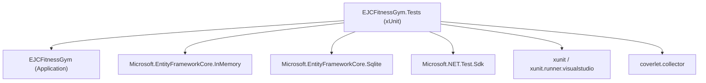
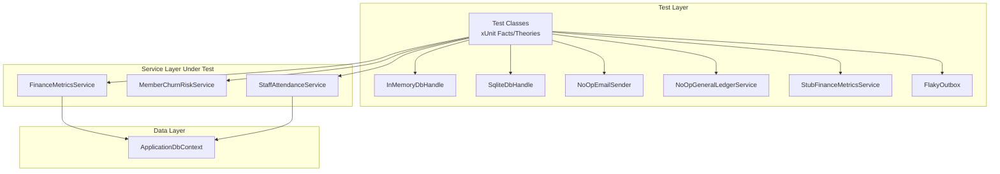
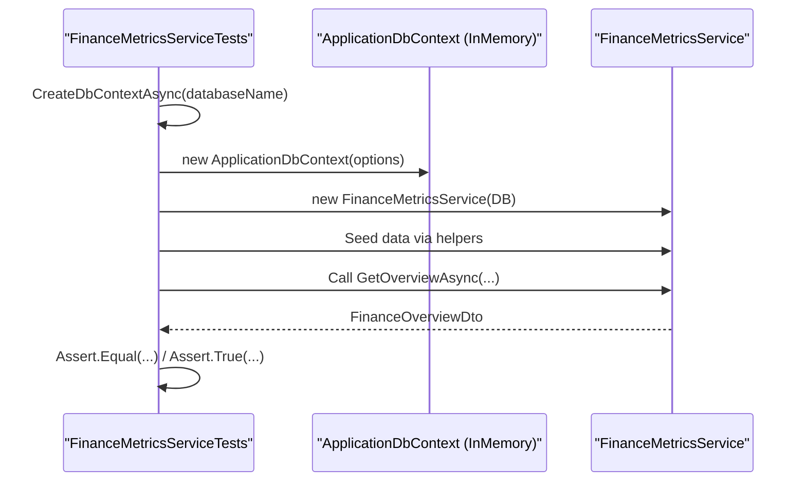
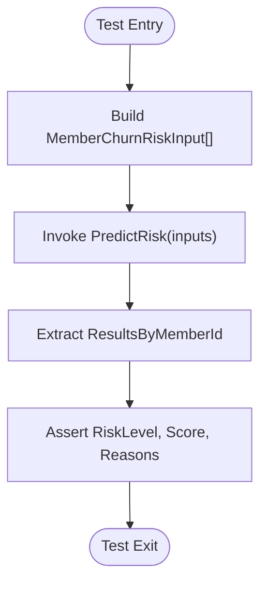
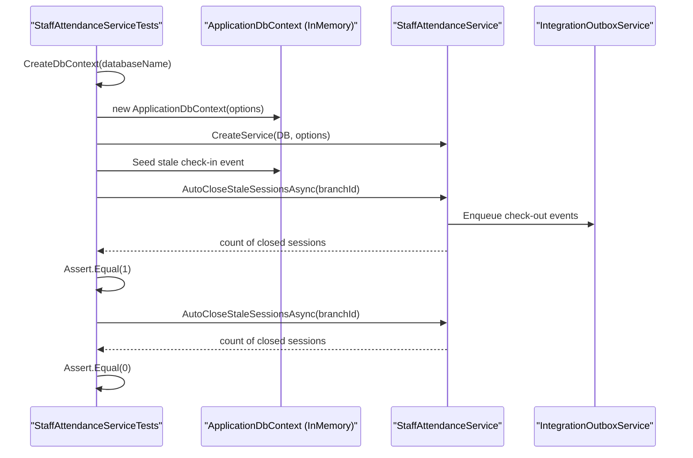
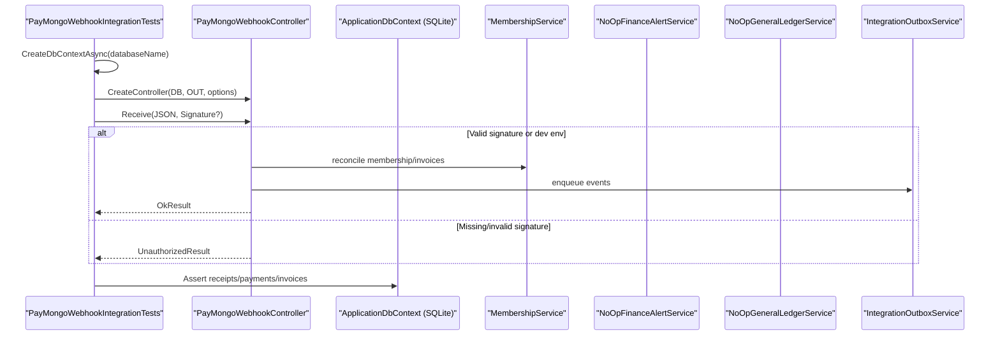
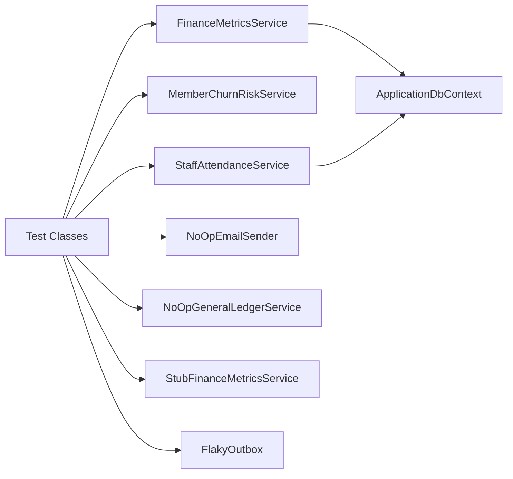

# Unit Testing Framework

<cite>
**Referenced Files in This Document**
- [EJCFitnessGym.Tests.csproj](file://EJCFitnessGym.Tests/EJCFitnessGym.Tests.csproj)
- [FinanceMetricsServiceTests.cs](file://EJCFitnessGym.Tests/FinanceMetricsServiceTests.cs)
- [MemberChurnRiskServiceTests.cs](file://EJCFitnessGym.Tests/MemberChurnRiskServiceTests.cs)
- [StaffAttendanceServiceTests.cs](file://EJCFitnessGym.Tests/StaffAttendanceServiceTests.cs)
- [PayMongoWebhookIntegrationTests.cs](file://EJCFitnessGym.Tests/PayMongoWebhookIntegrationTests.cs)
- [AuthPageModelsTests.cs](file://EJCFitnessGym.Tests/AuthPageModelsTests.cs)
- [BranchAccessTests.cs](file://EJCFitnessGym.Tests/BranchAccessTests.cs)
- [DashboardControllerTests.cs](file://EJCFitnessGym.Tests/DashboardControllerTests.cs)
- [ErpPhase1IntegrationTests.cs](file://EJCFitnessGym.Tests/ErpPhase1IntegrationTests.cs)
- [MembershipServiceBillingTests.cs](file://EJCFitnessGym.Tests/MembershipServiceBillingTests.cs)
- [FinanceMetricsService.cs](file://Services/Finance/FinanceMetricsService.cs)
- [IMemberChurnRiskService.cs](file://Services/AI/IMemberChurnRiskService.cs)
- [IStaffAttendanceService.cs](file://Services/Staff/IStaffAttendanceService.cs)
</cite>

## Table of Contents
1. [Introduction](#introduction)
2. [Project Structure](#project-structure)
3. [Core Components](#core-components)
4. [Architecture Overview](#architecture-overview)
5. [Detailed Component Analysis](#detailed-component-analysis)
6. [Dependency Analysis](#dependency-analysis)
7. [Performance Considerations](#performance-considerations)
8. [Troubleshooting Guide](#troubleshooting-guide)
9. [Conclusion](#conclusion)
10. [Appendices](#appendices)

## Introduction
This document explains the unit testing framework used in the EJC Fitness Gym system. It covers the xUnit configuration, test project setup, and patterns for isolating dependencies during tests. It documents how the test suite mocks external dependencies (such as PayMongo, email services, and database contexts), and details testing approaches for service-layer components including FinanceMetricsService, MemberChurnRiskService, and StaffAttendanceService. It also describes test database strategies, fixture patterns, assertion styles, and naming conventions used across the test suite.

## Project Structure
The test project is organized around focused test classes grouped by domain or concern. Each test class targets a specific service or controller and uses either in-memory or SQLite databases to isolate tests from shared state. The test project references the main application project and includes packages for xUnit, Entity Framework Core providers for in-memory and SQLite, and coverage collection.

**Diagram sources**
- [EJCFitnessGym.Tests.csproj:1-36](file://EJCFitnessGym.Tests/EJCFitnessGym.Tests.csproj#L1-L36)

**Section sources**
- [EJCFitnessGym.Tests.csproj:1-36](file://EJCFitnessGym.Tests/EJCFitnessGym.Tests.csproj#L1-L36)

## Core Components
- xUnit configuration and SDK: The test project targets .NET 8, enables nullable and implicit usings, and references xUnit and the Visual Studio runner. It also includes the .NET Test SDK and coverlet for coverage.
- Entity Framework test databases:
  - In-memory database via Microsoft.EntityFrameworkCore.InMemory for fast, isolated tests.
  - SQLite in-memory connection via Microsoft.EntityFrameworkCore.Sqlite for integration-style tests that require SQL semantics closer to production.
- Mocking external dependencies:
  - Controllers and services are constructed with minimal external dependencies using stubs or no-op implementations (e.g., no-op email sender, no-op general ledger service, stub finance metrics service).
  - Options patterns are mocked using lightweight monitors to supply configuration values.
- Test fixtures:
  - Lightweight disposable handles encapsulate DbContext lifetime and disposal for both in-memory and SQLite-backed tests.

**Section sources**
- [EJCFitnessGym.Tests.csproj:1-36](file://EJCFitnessGym.Tests/EJCFitnessGym.Tests.csproj#L1-L36)
- [FinanceMetricsServiceTests.cs:478-504](file://EJCFitnessGym.Tests/FinanceMetricsServiceTests.cs#L478-L504)
- [PayMongoWebhookIntegrationTests.cs:442-455](file://EJCFitnessGym.Tests/PayMongoWebhookIntegrationTests.cs#L442-L455)
- [StaffAttendanceServiceTests.cs:116-141](file://EJCFitnessGym.Tests/StaffAttendanceServiceTests.cs#L116-L141)
- [ErpPhase1IntegrationTests.cs:214-245](file://EJCFitnessGym.Tests/ErpPhase1IntegrationTests.cs#L214-L245)

## Architecture Overview
The testing architecture separates concerns by:
- Using in-memory databases for pure unit tests of services that primarily depend on EF Core queries.
- Using SQLite connections for integration tests that validate end-to-end flows (e.g., webhooks, inventory/ledger integrations).
- Constructing controllers/services with minimal dependencies by injecting stubs or no-op implementations for external systems (email, PayMongo reconciliation, general ledger).
- Employing deterministic fixtures and deterministic time windows to assert financial computations and projections.

**Diagram sources**
- [FinanceMetricsServiceTests.cs:11-59](file://EJCFitnessGym.Tests/FinanceMetricsServiceTests.cs#L11-L59)
- [MemberChurnRiskServiceTests.cs:5-33](file://EJCFitnessGym.Tests/MemberChurnRiskServiceTests.cs#L5-L33)
- [StaffAttendanceServiceTests.cs:79-95](file://EJCFitnessGym.Tests/StaffAttendanceServiceTests.cs#L79-L95)
- [PayMongoWebhookIntegrationTests.cs:264-289](file://EJCFitnessGym.Tests/PayMongoWebhookIntegrationTests.cs#L264-L289)
- [ErpPhase1IntegrationTests.cs:247-332](file://EJCFitnessGym.Tests/ErpPhase1IntegrationTests.cs#L247-L332)

## Detailed Component Analysis

### FinanceMetricsService Testing
- Scope and focus:
  - Tests validate financial computations across revenue, expenses, equipment assets, and forecasting.
  - Branch-scoping is validated using claims and branch IDs.
- Test database strategy:
  - Uses in-memory database per test method via a dedicated factory that builds DbContextOptions and returns a disposable handle.
- Assertion patterns:
  - Equality checks for aggregated totals and ratios.
  - Range checks for risk levels and anomaly severities.
  - Idempotency assertions for seeding routines.
- Fixture pattern:
  - Private seed helpers populate test data deterministically.
  - Disposable handles ensure proper disposal of DbContext and underlying resources.

**Diagram sources**
- [FinanceMetricsServiceTests.cs:11-59](file://EJCFitnessGym.Tests/FinanceMetricsServiceTests.cs#L11-L59)
- [FinanceMetricsServiceTests.cs:478-504](file://EJCFitnessGym.Tests/FinanceMetricsServiceTests.cs#L478-L504)

**Section sources**
- [FinanceMetricsServiceTests.cs:11-59](file://EJCFitnessGym.Tests/FinanceMetricsServiceTests.cs#L11-L59)
- [FinanceMetricsServiceTests.cs:158-206](file://EJCFitnessGym.Tests/FinanceMetricsServiceTests.cs#L158-L206)
- [FinanceMetricsServiceTests.cs:208-237](file://EJCFitnessGym.Tests/FinanceMetricsServiceTests.cs#L208-L237)
- [FinanceMetricsServiceTests.cs:239-279](file://EJCFitnessGym.Tests/FinanceMetricsServiceTests.cs#L239-L279)
- [FinanceMetricsServiceTests.cs:281-417](file://EJCFitnessGym.Tests/FinanceMetricsServiceTests.cs#L281-L417)
- [FinanceMetricsServiceTests.cs:419-476](file://EJCFitnessGym.Tests/FinanceMetricsServiceTests.cs#L419-L476)
- [FinanceMetricsServiceTests.cs:478-504](file://EJCFitnessGym.Tests/FinanceMetricsServiceTests.cs#L478-L504)

### MemberChurnRiskService Testing
- Scope and focus:
  - Validates risk scoring and categorization across multiple input profiles.
  - Ensures summary aggregation across risk levels.
- Test database strategy:
  - Stateless service; no database dependency.
- Assertion patterns:
  - Exact equality for risk level and score ranges.
  - Presence checks for reasons and summary counts.

**Diagram sources**
- [MemberChurnRiskServiceTests.cs:5-33](file://EJCFitnessGym.Tests/MemberChurnRiskServiceTests.cs#L5-L33)
- [MemberChurnRiskServiceTests.cs:35-60](file://EJCFitnessGym.Tests/MemberChurnRiskServiceTests.cs#L35-L60)
- [MemberChurnRiskServiceTests.cs:62-112](file://EJCFitnessGym.Tests/MemberChurnRiskServiceTests.cs#L62-L112)

**Section sources**
- [MemberChurnRiskServiceTests.cs:5-33](file://EJCFitnessGym.Tests/MemberChurnRiskServiceTests.cs#L5-L33)
- [MemberChurnRiskServiceTests.cs:35-60](file://EJCFitnessGym.Tests/MemberChurnRiskServiceTests.cs#L35-L60)
- [MemberChurnRiskServiceTests.cs:62-112](file://EJCFitnessGym.Tests/MemberChurnRiskServiceTests.cs#L62-L112)

### StaffAttendanceService Testing
- Scope and focus:
  - Validates automatic session closure for stale check-ins.
  - Verifies idempotency of repeated sweeps.
- Test database strategy:
  - Uses in-memory database per test via a dedicated factory.
- Mocking patterns:
  - Options are supplied via a lightweight IOptionsMonitor implementation.
  - Integration outbox is used to verify event publishing.
- Assertion patterns:
  - Counts for closed sessions and emitted events.
  - Absence of unintended side-effects on subsequent runs.

**Diagram sources**
- [StaffAttendanceServiceTests.cs:12-48](file://EJCFitnessGym.Tests/StaffAttendanceServiceTests.cs#L12-L48)
- [StaffAttendanceServiceTests.cs:79-95](file://EJCFitnessGym.Tests/StaffAttendanceServiceTests.cs#L79-L95)
- [StaffAttendanceServiceTests.cs:116-141](file://EJCFitnessGym.Tests/StaffAttendanceServiceTests.cs#L116-L141)

**Section sources**
- [StaffAttendanceServiceTests.cs:12-48](file://EJCFitnessGym.Tests/StaffAttendanceServiceTests.cs#L12-L48)
- [StaffAttendanceServiceTests.cs:49-77](file://EJCFitnessGym.Tests/StaffAttendanceServiceTests.cs#L49-L77)
- [StaffAttendanceServiceTests.cs:79-95](file://EJCFitnessGym.Tests/StaffAttendanceServiceTests.cs#L79-L95)
- [StaffAttendanceServiceTests.cs:116-141](file://EJCFitnessGym.Tests/StaffAttendanceServiceTests.cs#L116-L141)

### PayMongo Webhook Integration Testing
- Scope and focus:
  - Validates webhook idempotency, retry recovery, underpayment handling, and signature verification.
- Test database strategy:
  - Uses SQLite in-memory connection to simulate production-like SQL behavior.
- Mocking patterns:
  - No-op implementations for email sender and general ledger service.
  - Flaky outbox simulates transient failures.
  - Options monitor supplies PayMongo configuration.
  - Test host environment controls environment-dependent behavior.
- Assertion patterns:
  - Receipt statuses and attempt counts.
  - Invoice and payment states after processing.
  - Unauthorized responses when signatures are missing.

**Diagram sources**
- [PayMongoWebhookIntegrationTests.cs:23-61](file://EJCFitnessGym.Tests/PayMongoWebhookIntegrationTests.cs#L23-L61)
- [PayMongoWebhookIntegrationTests.cs:63-104](file://EJCFitnessGym.Tests/PayMongoWebhookIntegrationTests.cs#L63-L104)
- [PayMongoWebhookIntegrationTests.cs:264-289](file://EJCFitnessGym.Tests/PayMongoWebhookIntegrationTests.cs#L264-L289)
- [PayMongoWebhookIntegrationTests.cs:442-455](file://EJCFitnessGym.Tests/PayMongoWebhookIntegrationTests.cs#L442-L455)

**Section sources**
- [PayMongoWebhookIntegrationTests.cs:23-61](file://EJCFitnessGym.Tests/PayMongoWebhookIntegrationTests.cs#L23-L61)
- [PayMongoWebhookIntegrationTests.cs:63-104](file://EJCFitnessGym.Tests/PayMongoWebhookIntegrationTests.cs#L63-L104)
- [PayMongoWebhookIntegrationTests.cs:105-139](file://EJCFitnessGym.Tests/PayMongoWebhookIntegrationTests.cs#L105-L139)
- [PayMongoWebhookIntegrationTests.cs:140-205](file://EJCFitnessGym.Tests/PayMongoWebhookIntegrationTests.cs#L140-L205)
- [PayMongoWebhookIntegrationTests.cs:206-262](file://EJCFitnessGym.Tests/PayMongoWebhookIntegrationTests.cs#L206-L262)
- [PayMongoWebhookIntegrationTests.cs:442-455](file://EJCFitnessGym.Tests/PayMongoWebhookIntegrationTests.cs#L442-L455)

### Additional Test Coverage Areas
- Authentication page models:
  - Uses a test context to provision in-memory Identity stores and roles, then instantiates Razor Page models with injected services and a test environment.
- Branch access utilities:
  - Validates claim parsing and branch scoping logic for various roles.
- Dashboard controller:
  - Exercises role-based redirection logic with minimal dependencies.

**Section sources**
- [AuthPageModelsTests.cs:123-171](file://EJCFitnessGym.Tests/AuthPageModelsTests.cs#L123-L171)
- [AuthPageModelsTests.cs:195-229](file://EJCFitnessGym.Tests/AuthPageModelsTests.cs#L195-L229)
- [BranchAccessTests.cs:6-48](file://EJCFitnessGym.Tests/BranchAccessTests.cs#L6-L48)
- [DashboardControllerTests.cs:9-31](file://EJCFitnessGym.Tests/DashboardControllerTests.cs#L9-L31)

## Dependency Analysis
- Test project dependencies:
  - xUnit and runner for test discovery and execution.
  - EF Core providers for in-memory and SQLite to support different isolation and fidelity needs.
  - coverlet for coverage reporting.
- Service-layer dependencies:
  - FinanceMetricsService depends on ApplicationDbContext and performs complex aggregations and projections.
  - MemberChurnRiskService is stateless and depends only on input data structures.
  - StaffAttendanceService depends on ApplicationDbContext and an integration outbox for event emission.
- External dependency isolation:
  - Controllers and services are constructed with stubs or no-ops for PayMongo reconciliation, email sending, and general ledger posting to avoid network calls and side effects.

**Diagram sources**
- [FinanceMetricsService.cs:9-52](file://Services/Finance/FinanceMetricsService.cs#L9-L52)
- [IMemberChurnRiskService.cs:53-56](file://Services/AI/IMemberChurnRiskService.cs#L53-L56)
- [IStaffAttendanceService.cs:3-10](file://Services/Staff/IStaffAttendanceService.cs#L3-L10)
- [ErpPhase1IntegrationTests.cs:247-332](file://EJCFitnessGym.Tests/ErpPhase1IntegrationTests.cs#L247-L332)

**Section sources**
- [FinanceMetricsService.cs:9-52](file://Services/Finance/FinanceMetricsService.cs#L9-L52)
- [IMemberChurnRiskService.cs:53-56](file://Services/AI/IMemberChurnRiskService.cs#L53-L56)
- [IStaffAttendanceService.cs:3-10](file://Services/Staff/IStaffAttendanceService.cs#L3-L10)
- [ErpPhase1IntegrationTests.cs:247-332](file://EJCFitnessGym.Tests/ErpPhase1IntegrationTests.cs#L247-L332)

## Performance Considerations
- Prefer in-memory databases for unit tests that primarily exercise LINQ queries and calculations to minimize overhead.
- Use SQLite in-memory connections for integration tests that require SQL semantics similar to production.
- Keep test data minimal and deterministic to reduce query complexity and improve reproducibility.
- Avoid unnecessary SaveChanges calls inside tight loops; batch inserts and use AsNoTracking for read-heavy scenarios.

## Troubleshooting Guide
- Duplicate webhook processing:
  - Ensure inbound webhook receipts are recorded and idempotency checks are enforced before enqueuing events.
- Flaky outbox:
  - Simulate transient failures with a flaky outbox wrapper to validate retry logic and eventual consistency.
- Signature verification:
  - In production, require a webhook secret; in tests, assert unauthorized responses when the secret is missing.
- Stale session cleanup:
  - Validate that auto-close runs only once and does not reprocess already-closed sessions.

**Section sources**
- [PayMongoWebhookIntegrationTests.cs:25-61](file://EJCFitnessGym.Tests/PayMongoWebhookIntegrationTests.cs#L25-L61)
- [PayMongoWebhookIntegrationTests.cs:63-104](file://EJCFitnessGym.Tests/PayMongoWebhookIntegrationTests.cs#L63-L104)
- [PayMongoWebhookIntegrationTests.cs:208-231](file://EJCFitnessGym.Tests/PayMongoWebhookIntegrationTests.cs#L208-L231)
- [PayMongoWebhookIntegrationTests.cs:233-262](file://EJCFitnessGym.Tests/PayMongoWebhookIntegrationTests.cs#L233-L262)
- [StaffAttendanceServiceTests.cs:14-48](file://EJCFitnessGym.Tests/StaffAttendanceServiceTests.cs#L14-L48)

## Conclusion
The EJC Fitness Gym test suite employs a pragmatic mix of in-memory and SQLite-backed databases to isolate unit and integration tests. It consistently mocks external dependencies and uses deterministic fixtures to ensure reliable, fast, and maintainable tests. The patterns demonstrated here—disposable database handles, stubs/no-ops, and targeted assertions—provide a solid foundation for testing service-layer components and controller flows.

## Appendices

### Testing Best Practices for Service Layer Components
- Dependency isolation:
  - Inject stubs or no-ops for external systems (email, PayMongo, general ledger) to avoid flakiness and side effects.
- Deterministic time windows:
  - Use fixed time references and narrow date ranges to compute forecasts and anomalies.
- Idempotency checks:
  - Validate that seeding and maintenance routines produce consistent results across repeated runs.
- Assertion patterns:
  - Prefer equality checks for computed aggregates, range checks for risk levels, and presence checks for anomalies and summaries.
- Test data management:
  - Use small, deterministic datasets and seed helpers to keep tests readable and maintainable.

### Test Organization and Naming Conventions
- Test class names:
  - Follow the pattern "<ServiceName>Tests" (e.g., FinanceMetricsServiceTests, StaffAttendanceServiceTests).
- Test method names:
  - Use descriptive phrases in the form "<BehaviorUnderTest>_<Scenario>_<ExpectedOutcome>" (e.g., GetOverviewAsync_ComputesRevenueCostsAndNetProfit).
- Fixture and handle naming:
  - Use concise names like InMemoryDbHandle and SqliteDbHandle to indicate database backing and lifecycle management.