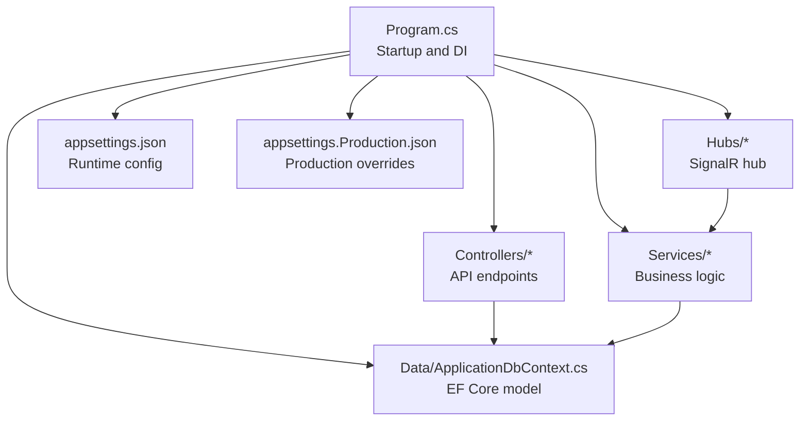
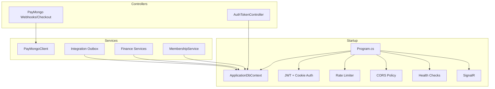
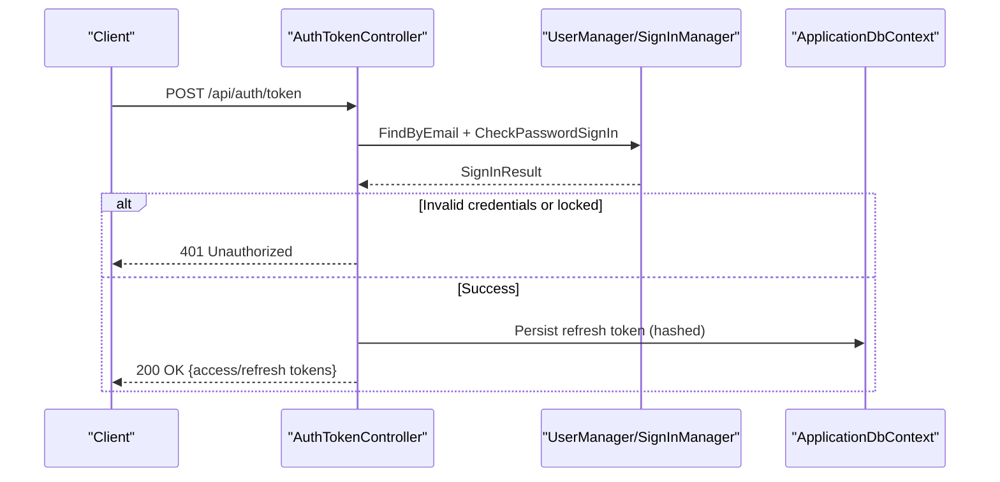
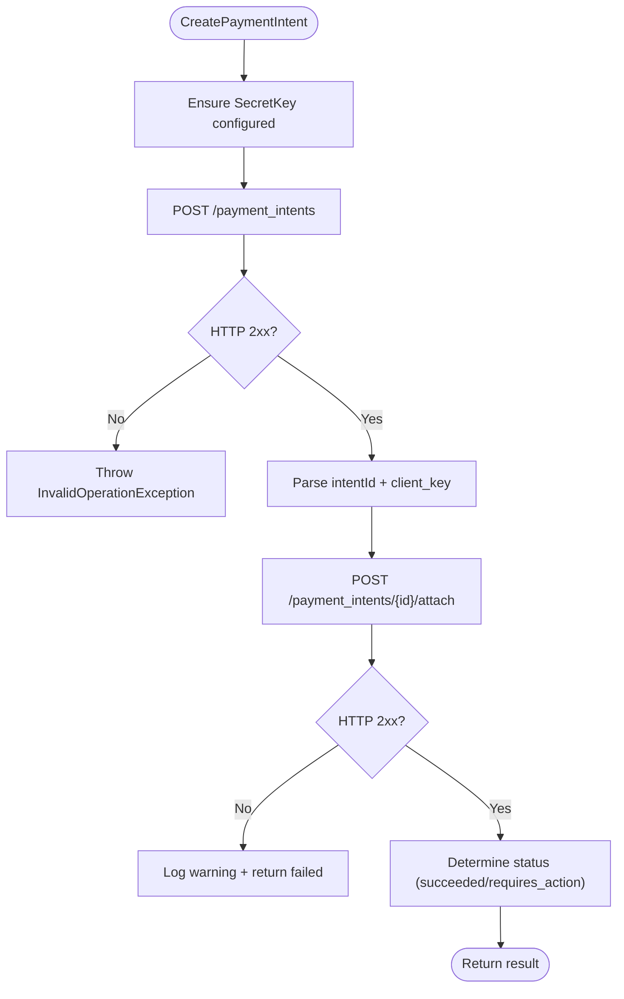
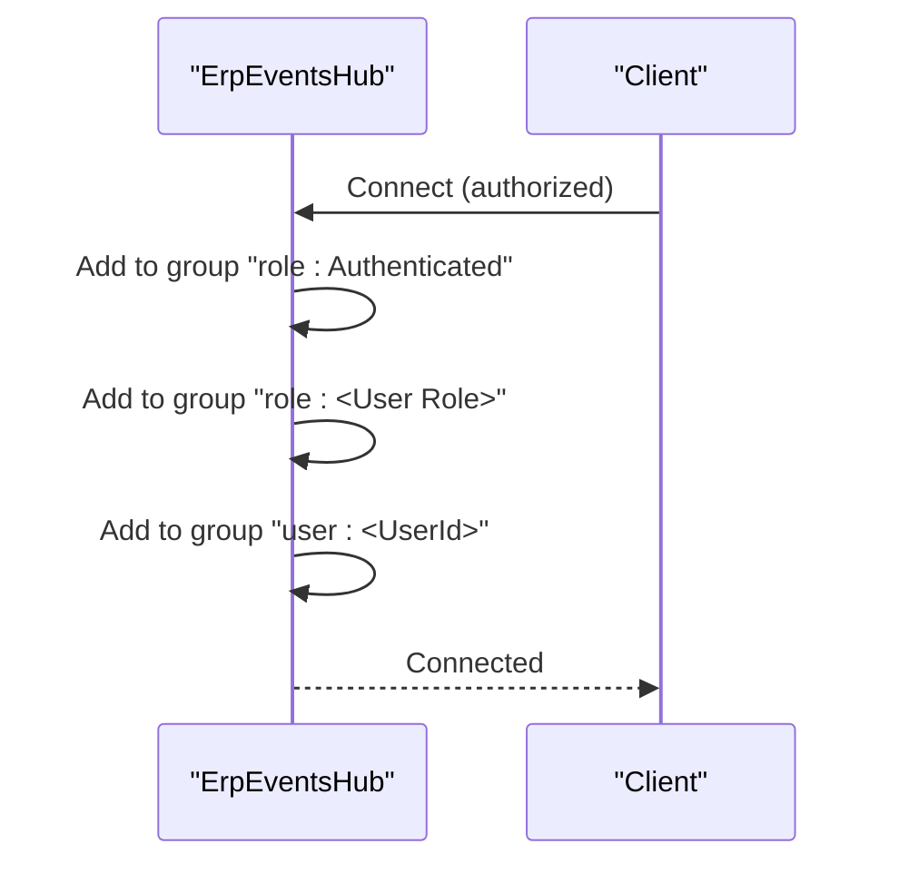
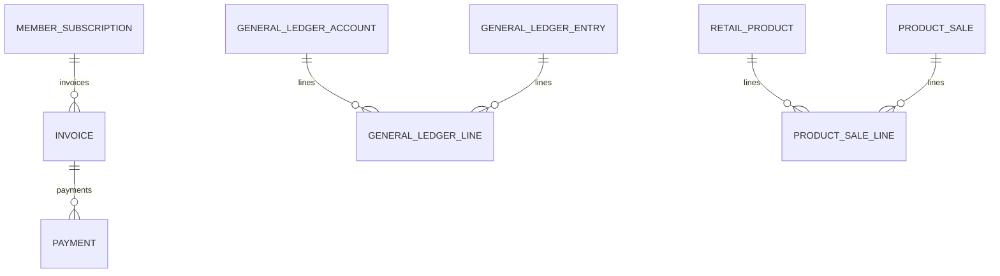
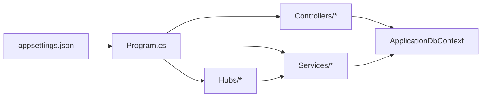

# Troubleshooting and FAQ

<cite>
**Referenced Files in This Document**
- [Program.cs](file://Program.cs)
- [appsettings.json](file://appsettings.json)
- [appsettings.Production.json](file://appsettings.Production.json)
- [README.md](file://README.md)
- [Data/ApplicationDbContext.cs](file://Data/ApplicationDbContext.cs)
- [Services/Payments/PayMongoClient.cs](file://Services/Payments/PayMongoClient.cs)
- [Controllers/AuthTokenController.cs](file://Controllers/AuthTokenController.cs)
- [Hubs/ErpEventsHub.cs](file://Hubs/ErpEventsHub.cs)
</cite>

## Table of Contents
1. [Introduction](#introduction)
2. [Project Structure](#project-structure)
3. [Core Components](#core-components)
4. [Architecture Overview](#architecture-overview)
5. [Detailed Component Analysis](#detailed-component-analysis)
6. [Dependency Analysis](#dependency-analysis)
7. [Performance Considerations](#performance-considerations)
8. [Troubleshooting Guide](#troubleshooting-guide)
9. [Conclusion](#conclusion)
10. [Appendices](#appendices)

## Introduction
This document provides comprehensive troubleshooting and FAQ guidance for the EJC Fitness Gym system. It focuses on installation and setup issues (database connectivity, migrations, dependencies), runtime problems (authentication, payment processing, real-time communication), debugging techniques, performance tuning, error interpretation, browser/client-side diagnostics, monitoring/logging, and frequently asked questions.

## Project Structure
The system is an ASP.NET Core 8 application with modular services, a robust DbContext, SignalR hubs for real-time events, and controllers for authentication and integrations. Configuration is centralized in JSON files, and health checks and rate limiting are configured at startup.

**Diagram sources**
- [Program.cs:32-473](file://Program.cs#L32-L473)
- [appsettings.json:1-126](file://appsettings.json#L1-L126)
- [appsettings.Production.json:1-33](file://appsettings.Production.json#L1-L33)
- [Data/ApplicationDbContext.cs:12-413](file://Data/ApplicationDbContext.cs#L12-L413)

**Section sources**
- [README.md:1-91](file://README.md#L1-L91)
- [Program.cs:32-473](file://Program.cs#L32-L473)
- [appsettings.json:1-126](file://appsettings.json#L1-L126)
- [appsettings.Production.json:1-33](file://appsettings.Production.json#L1-L33)

## Core Components
- Authentication and Authorization: JWT bearer and cookie policies, role-based access, branch scoping middleware, and rate limiting.
- Payments: PayMongo integration via a dedicated client with checkout sessions, intents, and status polling.
- Real-time Events: SignalR hub grouping authenticated users by roles and user IDs.
- Database: EF Core with precision-based decimal mappings, unique indexes, and cascading constraints.
- Background Workers: Scheduled tasks for integration dispatch, membership lifecycle, finance alerts, staff attendance, and auto billing.

Common symptoms and resolutions are covered in the Troubleshooting Guide below.

**Section sources**
- [Program.cs:57-105](file://Program.cs#L57-L105)
- [Program.cs:199-270](file://Program.cs#L199-L270)
- [Program.cs:386-395](file://Program.cs#L386-L395)
- [Services/Payments/PayMongoClient.cs:13-596](file://Services/Payments/PayMongoClient.cs#L13-L596)
- [Hubs/ErpEventsHub.cs:7-49](file://Hubs/ErpEventsHub.cs#L7-L49)
- [Data/ApplicationDbContext.cs:43-411](file://Data/ApplicationDbContext.cs#L43-L411)

## Architecture Overview
The system initializes services, applies migrations, seeds default data, and configures authentication, CORS, rate limiting, forwarded headers, HTTPS, CSP, and SignalR. Controllers depend on services and the database; services encapsulate domain logic and integrate with external systems (e.g., PayMongo).

**Diagram sources**
- [Program.cs:57-473](file://Program.cs#L57-L473)
- [Controllers/AuthTokenController.cs:20-47](file://Controllers/AuthTokenController.cs#L20-L47)
- [Services/Payments/PayMongoClient.cs:19-24](file://Services/Payments/PayMongoClient.cs#L19-L24)

## Detailed Component Analysis

### Authentication and Token Endpoint
- Validates credentials, enforces lockout, and issues JWT access tokens with roles and branch scopes.
- Supports refresh and revoke flows with hashed refresh tokens persisted in the database.
- Returns explicit errors for missing credentials, invalid/locked accounts, and missing JWT signing keys.

**Diagram sources**
- [Controllers/AuthTokenController.cs:52-117](file://Controllers/AuthTokenController.cs#L52-L117)
- [Controllers/AuthTokenController.cs:122-201](file://Controllers/AuthTokenController.cs#L122-L201)

**Section sources**
- [Controllers/AuthTokenController.cs:52-201](file://Controllers/AuthTokenController.cs#L52-L201)
- [Program.cs:199-270](file://Program.cs#L199-L270)

### PayMongo Payment Integration
- Creates customers, attaches payment methods, and handles payment intents.
- Supports checkout sessions and status lookup with robust parsing of amounts and timestamps.
- Throws descriptive exceptions when configuration is missing or API calls fail.

**Diagram sources**
- [Services/Payments/PayMongoClient.cs:137-245](file://Services/Payments/PayMongoClient.cs#L137-L245)

**Section sources**
- [Services/Payments/PayMongoClient.cs:13-596](file://Services/Payments/PayMongoClient.cs#L13-L596)

### Real-time Communication (SignalR)
- On connect, groups authenticated connections by role and user ID.
- Enables targeted broadcasting to authenticated users, back-office users, and specific users.

**Diagram sources**
- [Hubs/ErpEventsHub.cs:12-47](file://Hubs/ErpEventsHub.cs#L12-L47)

**Section sources**
- [Hubs/ErpEventsHub.cs:7-49](file://Hubs/ErpEventsHub.cs#L7-L49)

### Database Model and Indexes
- Precision-based decimals for financial entities.
- Unique indexes for gateway identifiers and invoice numbers.
- Cascading deletes and foreign keys for referential integrity.

**Diagram sources**
- [Data/ApplicationDbContext.cs:19-411](file://Data/ApplicationDbContext.cs#L19-L411)

**Section sources**
- [Data/ApplicationDbContext.cs:43-411](file://Data/ApplicationDbContext.cs#L43-L411)

## Dependency Analysis
- Startup depends on configuration for JWT, Google OAuth, PayMongo, forwarded headers, and operational health thresholds.
- Controllers depend on Identity services and the database; services encapsulate external integrations and domain logic.
- SignalR hub depends on authorization policies and user claims.

**Diagram sources**
- [appsettings.json:1-126](file://appsettings.json#L1-L126)
- [Program.cs:57-473](file://Program.cs#L57-L473)

**Section sources**
- [Program.cs:57-473](file://Program.cs#L57-L473)
- [appsettings.json:1-126](file://appsettings.json#L1-L126)

## Performance Considerations
- Database indexing: Unique indexes on gateway identifiers and invoice numbers; composite indexes on branch-scoped queries improve performance.
- Decimal precision: Ensures accurate financial computations and reduces rounding errors.
- Background workers: Tunable intervals and batch sizes for integration outbox, membership lifecycle, finance alert evaluation, staff attendance, and auto billing.
- Rate limiting: Fixed window limiter to mitigate brute force and protect endpoints.
- Health checks: Operational readiness health check and self-health status for liveness/readiness.

[No sources needed since this section provides general guidance]

## Troubleshooting Guide

### Installation and Setup Issues

- Database connection string not found
  - Symptom: Startup throws an exception indicating the default connection string is missing.
  - Resolution: Set the connection string in the appropriate configuration file and environment. Ensure the target SQL Server instance is reachable.
  - Section sources
    - [Program.cs:57](file://Program.cs#L57)

- LocalDB and Google OAuth secrets
  - Symptom: Missing Google ClientId/ClientSecret when using LocalDB.
  - Resolution: Provide secrets via development configuration or environment variables. The application attempts to load them from a development JSON file when missing.
  - Section sources
    - [Program.cs:118-132](file://Program.cs#L118-L132)

- PayMongo secrets missing
  - Symptom: Exceptions when PayMongo is enabled without required keys.
  - Resolution: Configure PayMongo SecretKey, PublicKey, and optionally WebhookSecret in production. For development, keys can be omitted but checkout flows may be limited.
  - Section sources
    - [Program.cs:146-169](file://Program.cs#L146-L169)
    - [Services/Payments/PayMongoClient.cs:285-288](file://Services/Payments/PayMongoClient.cs#L285-L288)

- JWT signing key not configured
  - Symptom: Token issuance returns service unavailable with a signing key error.
  - Resolution: Set Jwt:SigningKey in configuration. In development, a fallback key is used; in production, a strong key is mandatory.
  - Section sources
    - [Program.cs:92-105](file://Program.cs#L92-L105)
    - [Controllers/AuthTokenController.cs:291-302](file://Controllers/AuthTokenController.cs#L291-L302)

- Database migration failures at startup
  - Symptom: Startup logs indicate migration failure during initialization.
  - Resolution: Inspect migration scripts, fix schema conflicts, and rerun migrations. Review logs for specific SQL errors.
  - Section sources
    - [Program.cs:722-727](file://Program.cs#L722-L727)

- CORS and forwarded headers misconfiguration
  - Symptom: Requests blocked or wrong origin/protocol detected.
  - Resolution: Configure AllowedHosts, ForwardedHeaders, and CORS origins according to deployment environment.
  - Section sources
    - [Program.cs:419-437](file://Program.cs#L419-L437)
    - [Program.cs:184-189](file://Program.cs#L184-L189)

### Runtime Issues

- Authentication failures
  - Invalid credentials or locked account: Controller returns 401 with a descriptive message.
  - Missing JWT signing key: Token endpoint returns 503 with a signing key error.
  - Insufficient role/branch scope: Forbids access.
  - Section sources
    - [Controllers/AuthTokenController.cs:66-84](file://Controllers/AuthTokenController.cs#L66-L84)
    - [Controllers/AuthTokenController.cs:291-302](file://Controllers/AuthTokenController.cs#L291-L302)
    - [Program.cs:315-343](file://Program.cs#L315-L343)

- Payment processing errors
  - PayMongo API failures: Exceptions thrown with HTTP status and body details; checkout/session lookups handle partial or missing fields gracefully.
  - 3D Secure required: Payment intent status indicates requires_action; frontend must handle 3DS flow.
  - Section sources
    - [Services/Payments/PayMongoClient.cs:63-66](file://Services/Payments/PayMongoClient.cs#L63-L66)
    - [Services/Payments/PayMongoClient.cs:182-185](file://Services/Payments/PayMongoClient.cs#L182-L185)
    - [Services/Payments/PayMongoClient.cs:235-239](file://Services/Payments/PayMongoClient.cs#L235-L239)

- Real-time communication problems
  - Clients disconnected or not receiving events: Verify SignalR hub authorization and group membership logic; ensure clients reconnect after authentication.
  - Section sources
    - [Hubs/ErpEventsHub.cs:12-47](file://Hubs/ErpEventsHub.cs#L12-L47)

- Background worker anomalies
  - Integration outbox not progressing: Check thresholds and logs for pending/outbox counts; adjust poll interval and batch size.
  - Finance alerts not firing: Validate evaluator configuration and lookback/forecast windows.
  - Membership lifecycle or auto billing not running: Confirm worker intervals and run-on-startup settings.
  - Section sources
    - [appsettings.json:94-107](file://appsettings.json#L94-L107)
    - [appsettings.json:65-69](file://appsettings.json#L65-L69)
    - [appsettings.json:70-83](file://appsettings.json#L70-L83)

### Debugging Techniques

- Authentication controller
  - Enable detailed logging around token issuance and refresh flows; inspect claims and branch scopes.
  - Section sources
    - [Controllers/AuthTokenController.cs:52-201](file://Controllers/AuthTokenController.cs#L52-L201)

- PayMongo client
  - Capture HTTP requests/responses; log status codes and bodies; parse metadata and timestamps carefully.
  - Section sources
    - [Services/Payments/PayMongoClient.cs:137-245](file://Services/Payments/PayMongoClient.cs#L137-L245)

- SignalR hub
  - Verify OnConnectedAsync adds groups for authenticated users and roles; test reconnections.
  - Section sources
    - [Hubs/ErpEventsHub.cs:12-47](file://Hubs/ErpEventsHub.cs#L12-L47)

- Database queries
  - Use SQL Profiler or EF Core logging to identify slow queries; review indexes and predicates.
  - Section sources
    - [Data/ApplicationDbContext.cs:43-411](file://Data/ApplicationDbContext.cs#L43-L411)

### Error Message Interpretation and Resolution

- “PayMongo CreateCustomer failed”
  - Cause: API returned non-success status or missing customer ID.
  - Action: Inspect status code and response body; confirm secret key and network access.
  - Section sources
    - [Services/Payments/PayMongoClient.cs:63-66](file://Services/Payments/PayMongoClient.cs#L63-L66)

- “PayMongo CreatePaymentIntent failed”
  - Cause: Intent creation or attachment failure.
  - Action: Log status and body; handle requires_action for 3D Secure.
  - Section sources
    - [Services/Payments/PayMongoClient.cs:182-185](file://Services/Payments/PayMongoClient.cs#L182-L185)
    - [Services/Payments/PayMongoClient.cs:235-239](file://Services/Payments/PayMongoClient.cs#L235-L239)

- “PayMongo SecretKey is not configured”
  - Cause: Missing PayMongo secret key in configuration.
  - Action: Set PayMongo:SecretKey and redeploy.
  - Section sources
    - [Services/Payments/PayMongoClient.cs:285-288](file://Services/Payments/PayMongoClient.cs#L285-L288)

- “JWT signing key is not configured.”
  - Cause: Missing Jwt:SigningKey in production.
  - Action: Set a strong signing key; restart.
  - Section sources
    - [Controllers/AuthTokenController.cs:95-99](file://Controllers/AuthTokenController.cs#L95-L99)

- “Database migration failed at startup.”
  - Cause: EF Core migration errors during application start.
  - Action: Fix migration script issues; rerun migrations; check logs for SQL errors.
  - Section sources
    - [Program.cs:722-727](file://Program.cs#L722-L727)

### Browser Compatibility and Client-side Troubleshooting
- Ensure modern browsers support ES modules and WebSocket connections for SignalR.
- Verify Content-Security-Policy allows required resources and frames for Google OAuth and CDN-hosted libraries.
- Section sources
  - [Program.cs:686-698](file://Program.cs#L686-L698)

### Monitoring and Logging
- Health checks: Liveness and readiness endpoints expose operational status.
- Logging: Adjust log levels per environment; monitor warnings and errors.
- Section sources
  - [Program.cs:386-394](file://Program.cs#L386-L394)
  - [appsettings.json:118-123](file://appsettings.json#L118-L123)
  - [appsettings.Production.json:27-32](file://appsettings.Production.json#L27-L32)

## Conclusion
This guide consolidates actionable steps to diagnose and resolve common installation, runtime, and operational issues in the EJC Fitness Gym system. By aligning configuration, validating external integrations, leveraging built-in health checks and logging, and applying the debugging techniques outlined above, most problems can be quickly identified and resolved.

## Appendices

### Frequently Asked Questions

- Can I run the system with LocalDB?
  - Yes, LocalDB is supported. Some integrations (Google OAuth, PayMongo) may require additional configuration in development.
  - Section sources
    - [README.md:39-40](file://README.md#L39-L40)
    - [Program.cs:118-132](file://Program.cs#L118-L132)

- How do I seed the database?
  - Run the EF Core update command to apply migrations and seed default data on first run.
  - Section sources
    - [README.md:55-58](file://README.md#L55-L58)

- What are the default credentials?
  - See the demo credentials table for initial user accounts.
  - Section sources
    - [README.md:67-75](file://README.md#L67-L75)

- How do I configure production security?
  - Set production overrides for JWT, Google OAuth, PayMongo, forwarded headers, and logging levels.
  - Section sources
    - [appsettings.Production.json:1-33](file://appsettings.Production.json#L1-L33)

- How do I troubleshoot SignalR real-time events?
  - Confirm authentication, group membership, and client reconnection behavior.
  - Section sources
    - [Hubs/ErpEventsHub.cs:12-47](file://Hubs/ErpEventsHub.cs#L12-L47)